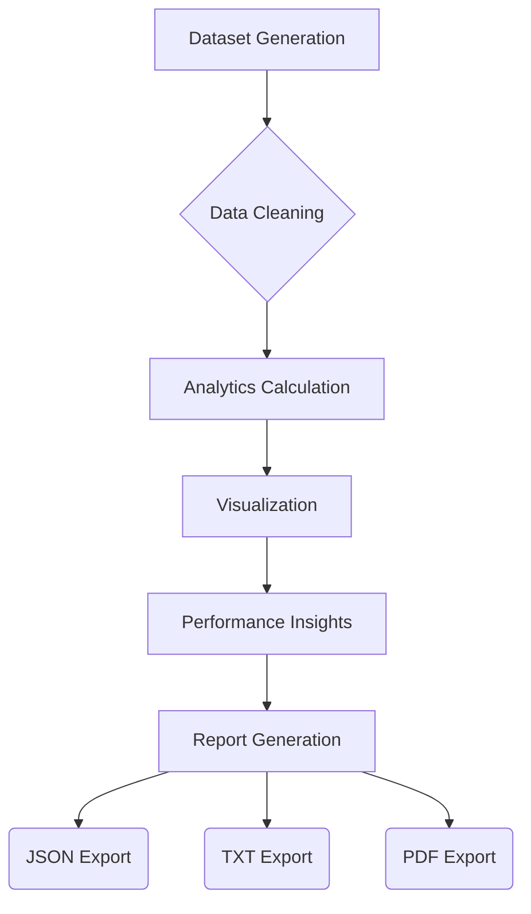

# Candidate Performance Analytics 

## Project Overview

This project is an integral part of an **AI Assessment System**, specifically focusing on the advanced analysis of candidate assessment performance. It provides a robust, end-to-end solution for evaluating candidates in an automated and insightful manner.

The system is designed to:

*   **Generate** realistic and diverse assessment datasets, accommodating various scenarios.
*   **Handle** missing answers and support partial assessments seamlessly.
*   **Calculate** a comprehensive set of performance metrics.
*   **Produce** dashboard-ready analytics for quick interpretation.
*   **Generate** automated and professional reports in multiple formats.

##  Task Objective

The primary objective of this module is to prepare and analyze candidate performance data from AI assessments. It aims to provide clear, actionable insights into how candidates perform across different areas.

**Key Metrics Generated:**

*   **Accuracy**: Overall correctness of answers.
*   **Completion Rate**: Proportion of attempted questions.
*   **Domain-wise Performance**: Performance across specific subject areas (e.g., NLP, LLMs).
*   **Difficulty-wise Performance**: Performance across different difficulty levels (Easy, Medium, Hard).

## Features

### Core Features

*   **Synthetic Assessment Dataset Generation**: Creates diverse datasets simulating various candidate responses, including edge cases like missing answers and partial assessments.
*   **Data Cleaning and Preprocessing**: Robust cleaning functions to handle missing values, ensure data integrity, and standardize formats.
*   **Missing Answer Handling**: Automatically identifies and categorizes unanswered questions.
*   **Partial Assessment Support**: Accurately calculates metrics even when candidates do not complete all assigned questions.
*   **Accuracy Calculation**: Precise measurement of correctness among attempted questions.
*   **Completion Rate Calculation**: Quantification of the proportion of questions attempted by candidates.
*   **Domain-wise Analysis**: Breakdown of performance across specific domains (e.g., NLP, LLMs, Python, Machine Learning, Data Science).
*   **Difficulty-wise Analysis**: Evaluation of performance across different question difficulty levels (Easy, Medium, Hard).
*   **Dashboard-Ready JSON Output**: Export of analytics results in a structured JSON format for easy integration with dashboards or other systems.
*   **Visualization Charts**: Generation of clear and informative charts using Matplotlib to visually represent performance metrics.
*   **Automated Report Generation**: Creation of detailed reports in multiple formats for easy sharing and review.

### Advanced Features

*   **Candidate-Specific Analytics**: Ability to focus the analysis on individual candidates for granular insights.
*   **User-Driven Candidate Selection**: Interactive prompts allow users to select specific candidates for detailed reporting.
*   **Automated PDF Report Generation**: Production of multi-page, professional PDF reports using ReportLab, complete with embedded charts.
*   **Automated TXT Report Generation**: Creation of human-readable text-based reports for quick review.
*   **Performance Grading System**: Assignment of grades (A-F) based on predefined accuracy thresholds.
*   **Performance Insights Generation**: AI-based interpretation of results to identify strengths and areas for improvement.
*   **Pass/Fail Classification**: Automated determination of a candidate's pass or fail status.
*   **Strongest and Weakest Domain Identification**: Pinpointing top-performing and underperforming domains.
*   **Best and Most Challenging Difficulty Level Identification**: Highlighting difficulty levels where a candidate excels or struggles.

## Dataset Structure

The synthetic dataset generated for this project includes the following fields:

| Field            | Description                                                                 |
| :--------------- | :-------------------------------------------------------------------------- |
| `candidate_id`   | Unique identifier for each candidate (e.g., `C001`).                        |
| `question_id`    | Unique identifier for each question (e.g., `Q001`).                         |
| `domain`         | The subject area of the question (e.g., 'NLP', 'Python').                   |
| `difficulty`     | The difficulty level of the question ('Easy', 'Medium', 'Hard').            |
| `correct_answer` | The correct answer to the question (e.g., 'A', 'B').                        |
| `candidate_answer` | The answer provided by the candidate. Can be `None` or an empty string (`''`) for unattempted questions. |
| `is_correct`     | Boolean (`True`/`False`) indicating if the `candidate_answer` was correct.   |
| `is_attempted`   | Boolean (`True`/`False`) indicating if the candidate made an attempt (i.e., `candidate_answer` is not `None` or `''`). |

##  Technologies Used

*   **Python**: The primary programming language.
*   **Pandas**: For data manipulation and analysis.
*   **NumPy**: For numerical operations.
*   **Matplotlib**: For generating static, interactive, and animated visualizations.
*   **ReportLab**: For creating professional, multi-page PDF reports.
*   **JSON**: For structured data interchange and output.
*   **Jupyter Notebook Environment**: The development and execution environment.

##  Project Workflow



##  Metrics Calculation

*   **Accuracy**
    ```
    (Number of Correct Answers / Number of Attempted Questions) * 100
    ```
*   **Completion Rate**
    ```
    (Number of Attempted Questions / Total Number of Questions) * 100
    ```
*   **Domain-wise Performance**
    Calculated as Accuracy applied only to questions within a specific domain.
*   **Difficulty-wise Performance**
    Calculated as Accuracy applied only to questions of a specific difficulty level.

##  Handling Edge Cases

This system is designed to gracefully handle various real-world assessment scenarios:

*   **Missing Answers**: Clearly identifies questions left unanswered, impacting completion rate rather than penalizing accuracy.
*   **Unanswered Questions**: Distinguished from incorrect answers; they do not count towards accuracy but are factored into completion rate.
*   **Partial Assessments**: The system provides meaningful analytics even if a candidate does not complete all assigned questions.
*   **Candidate with No Attempts**: Properly reports 0% accuracy and 0% completion rate without errors.
*   **Candidate with All Correct Answers**: Correctly reflects 100% accuracy and appropriate insights.
*   **Candidate with All Incorrect Answers**: Accurately reports 0% accuracy and highlights areas for improvement.

##  User Input Functionality

### Candidate Selection

The analytics engine allows users to interactively select a specific candidate ID for detailed, individualized analysis. This is facilitated via a user prompt within the notebook.

**Example Interaction:**

```
Enter a Candidate ID for analysis: C008
```

Upon selection, the system automatically generates:

*   Candidate-specific overall accuracy
*   Candidate-specific completion rate
*   Candidate-specific domain performance breakdown
*   Candidate-specific difficulty performance breakdown
*   Personalized AI-based insights
*   A dedicated multi-page PDF report for the candidate
*   A dedicated text report for the candidate

##  Automated Reporting System

The project automatically generates professional, human-readable reports designed for stakeholders, recruiters, and candidates.

1.  **Overall Assessment Analytics**: Provides an aggregated view of all candidates' performance.
    *   Files: `output/overall_report.txt`, `output/overall_report.pdf`

2.  **Candidate-Specific Analytics**: Delivers a focused, detailed analysis for a single selected candidate.
    *   Files: `output/candidate_report_CXXX.txt`, `output/candidate_report_CXXX.pdf` (where CXXX is the candidate ID)

**Report Contents Include:**

*   Executive summary of assessment performance.
*   Overall Accuracy and Completion Rate.
*   Detailed Domain-wise Analysis.
*   Detailed Difficulty-wise Analysis.
*   AI-based Performance Insights (strengths, areas for improvement).
*   Assigned Grade and Pass/Fail status.
*   Personalized Recommendations and Next Steps.
*   Embedded visualizations (charts) within PDF reports for clarity.

##  Performance Grading System

The system employs a clear grading scale to classify candidate performance:

| Accuracy Range | Grade | Classification      |
| :------------- | :---- | :------------------ |
| 90–100%        | A+    | Outstanding         |
| 80–89%         | A     | Excellent           |
| 70–79%         | B     | Good                |
| 60–69%         | C     | Average             |
| 40–59%         | D     | Needs Improvement   |
| Below 40%      | F     | Poor                |

##  Sample Output

An example of the dashboard-ready JSON output:

```json
{
  "accuracy": 60.5,
  "completion_rate": 79.33,
  "attempted_questions": 119,
  "unanswered_questions": 31,
  "domain_scores": {
    "NLP": 75.0,
    "Python": 68.0,
    "LLMs": 55.0
  },
  "difficulty_performance": {
    "Easy": 70.0,
    "Medium": 60.0,
    "Hard": 50.0
  }
}
```

##  Output Files

All generated output files are saved in the `output/` directory:

```
output/
├── analytics_dataset.csv             # Cleaned and processed overall assessment data
├── candidate_analytics.json          # Aggregated performance metrics for overall dataset
├── overall_report.txt                # Text-based report for overall analytics
├── overall_report.pdf                # Multi-page PDF report for overall analytics
│
├── analytics_dataset_CXXX.csv        # Cleaned and processed data for a specific candidate (e.g., C009)
├── candidate_analytics_CXXX.json     # Aggregated performance metrics for a specific candidate
├── candidate_report_CXXX.txt         # Text-based report for a specific candidate
├── candidate_report_CXXX.pdf         # Multi-page PDF report for a specific candidate
│
├── overall_overall_performance.png   # Visualization: Overall Accuracy & Completion Rate
├── overall_domain_performance.png    # Visualization: Overall Domain-wise Performance
├── overall_difficulty_performance.png# Visualization: Overall Difficulty-wise Performance
│
├── candidate_CXXX_overall_performance.png  # Visualization: Candidate Overall Metrics
├── candidate_CXXX_domain_performance.png   # Visualization: Candidate Domain-wise Performance
└── candidate_CXXX_difficulty_performance.png # Visualization: Candidate Difficulty-wise Performance
```

##  Installation

To run this project, ensure you have the necessary Python packages installed. You can install them using pip:

```bash
pip install pandas numpy matplotlib reportlab pdf2image
!apt-get install poppler-utils -qq # Required for pdf2image to convert PDFs to images
```

##  Running the Project

This project is designed to be run in a Jupyter Notebook environment.

1.  **Open the Notebook**: Open the `.ipynb` notebook file in your preferred Jupyter environment (e.g., Jupyter Lab, VS Code with Jupyter extensions).
2.  **Run All Cells**: Execute all code cells sequentially from top to bottom.
3.  **Generate Dataset**: The notebook will first generate a synthetic dataset based on user-provided or default parameters.
4.  **Select Candidate**: Follow the interactive prompts to select a specific candidate ID for detailed analysis.
5.  **Generate Analytics**: The system will then compute all performance metrics and insights.
6.  **Export Reports**: All analytics, visualizations, and reports (JSON, CSV, TXT, PDF) will be automatically generated and saved to the `output/` folder. PDF reports will also be displayed page-by-page within the notebook output if the environment supports it.

##  Screenshots

<!-- Placeholder for Screenshots -->

*   **Dashboard Screenshot**
    
*   **Candidate Report Screenshot**
    
*   **PDF Report Screenshot**
    
*   **Analytics Charts Screenshot**
    

##  Project Deliverables

*   **Analytics Dataset**: Cleaned and validated raw assessment data.
*   **Summary Notebook**: The Jupyter notebook (`.ipynb`) containing all code, analysis, and output.
*   **Documentation**: This comprehensive `README.md` file.
*   **Dashboard-Ready Analytics**: JSON and CSV files containing processed metrics.
*   **Automated Reports**: Professional TXT and multi-page PDF reports for overall and candidate-specific analysis.

##  Acceptance Criteria Coverage

| Task Requirement                          | Implemented Feature(s)                                   |
| :---------------------------------------- | :------------------------------------------------------- |
| Generate synthetic dataset                | `generate_assessment_data` function                      |
| Clean and validate data                   | `clean_assessment_data` function, `is_attempted` column  |
| Calculate overall accuracy                | `calculate_overall_metrics` function                     |
| Calculate completion rate                 | `calculate_overall_metrics` function                     |
| Calculate domain-wise performance         | `calculate_domain_performance` function                  |
| Calculate difficulty-wise performance     | `calculate_difficulty_performance` function              |
| Visualize metrics (charts)                | `plot_analytics` function (Matplotlib)                   |
| Interactive user input (candidate select) | `get_candidate_id_input` function                        |
| Candidate-specific analysis               | Filtering data, `analytics_results_candidate`            |
| Export results to JSON                    | `export_results` function (`.json` files)                |
| Export results to CSV                     | `export_results` function (`.csv` files)                 |
| Generate text reports                     | `generate_text_report` function (`.txt` files)           |
| Generate multi-page PDF reports           | `generate_pdf_report` function (ReportLab, `.pdf` files) |
| PDF cover page, exec summary, charts      | `_create_cover_page`, `_create_executive_summary`, `_create_performance_dashboard` |
| AI-based insights generation              | `generate_insights` function                             |
| Performance grading system                | `generate_performance_grade` function                    |
| Pass/Fail classification                  | `generate_performance_grade` function                    |
| Identify strengths/areas for improvement  | `generate_insights` function                             |
| Handle missing/unattempted answers        | `clean_assessment_data` (`is_attempted` column)          |

##  Future Enhancements

*   **Streamlit Dashboard Integration**: Develop an interactive web dashboard for real-time visualization and filtering.
*   **MongoDB Integration**: Store assessment data in a NoSQL database for scalability and flexibility.
*   **Real Assessment Data Ingestion**: Develop modules to ingest data from actual AI assessment platforms.
*   **Multi-Candidate Comparison**: Implement features to compare multiple candidates side-by-side.
*   **LLM-Generated Feedback**: Integrate advanced LLMs to provide more nuanced and personalized textual feedback.
*   **Cloud Deployment**: Deploy the analytics system on cloud platforms (e.g., GCP, AWS) for production use.