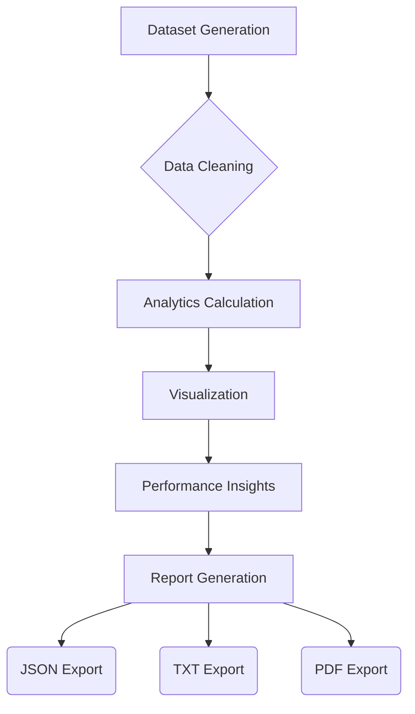

# Candidate Performance Analytics Notebook

> This notebook has been converted to markdown format for easy GitHub editing.

## Cell 1

**Type:** Markdown

# Candidate Performance Analytics 

## Project Overview

This project is an integral part of an **AI Assessment System**, specifically focusing on the advanced analysis of candidate assessment performance. It provides a robust, end-to-end solution for evaluating candidates in an automated and insightful manner.

The system is designed to:

*   **Generate** realistic and diverse assessment datasets, accommodating various scenarios.
*   **Handle** missing answers and support partial assessments seamlessly.
*   **Calculate** a comprehensive set of performance metrics.
*   **Produce** dashboard-ready analytics for quick interpretation.
*   **Generate** automated and professional reports in multiple formats.

##  Task Objective

The primary objective of this module is to prepare and analyze candidate performance data from AI assessments. It aims to provide clear, actionable insights into how candidates perform across different areas.

**Key Metrics Generated:**

*   **Accuracy**: Overall correctness of answers.
*   **Completion Rate**: Proportion of attempted questions.
*   **Domain-wise Performance**: Performance across specific subject areas (e.g., NLP, LLMs).
*   **Difficulty-wise Performance**: Performance across different difficulty levels (Easy, Medium, Hard).

## Features

### Core Features

*   **Synthetic Assessment Dataset Generation**: Creates diverse datasets simulating various candidate responses, including edge cases like missing answers and partial assessments.
*   **Data Cleaning and Preprocessing**: Robust cleaning functions to handle missing values, ensure data integrity, and standardize formats.
*   **Missing Answer Handling**: Automatically identifies and categorizes unanswered questions.
*   **Partial Assessment Support**: Accurately calculates metrics even when candidates do not complete all assigned questions.
*   **Accuracy Calculation**: Precise measurement of correctness among attempted questions.
*   **Completion Rate Calculation**: Quantification of the proportion of questions attempted by candidates.
*   **Domain-wise Analysis**: Breakdown of performance across specific domains (e.g., NLP, LLMs, Python, Machine Learning, Data Science).
*   **Difficulty-wise Analysis**: Evaluation of performance across different question difficulty levels (Easy, Medium, Hard).
*   **Dashboard-Ready JSON Output**: Export of analytics results in a structured JSON format for easy integration with dashboards or other systems.
*   **Visualization Charts**: Generation of clear and informative charts using Matplotlib to visually represent performance metrics.
*   **Automated Report Generation**: Creation of detailed reports in multiple formats for easy sharing and review.

### Advanced Features

*   **Candidate-Specific Analytics**: Ability to focus the analysis on individual candidates for granular insights.
*   **User-Driven Candidate Selection**: Interactive prompts allow users to select specific candidates for detailed reporting.
*   **Automated PDF Report Generation**: Production of multi-page, professional PDF reports using ReportLab, complete with embedded charts.
*   **Automated TXT Report Generation**: Creation of human-readable text-based reports for quick review.
*   **Performance Grading System**: Assignment of grades (A-F) based on predefined accuracy thresholds.
*   **Performance Insights Generation**: AI-based interpretation of results to identify strengths and areas for improvement.
*   **Pass/Fail Classification**: Automated determination of a candidate's pass or fail status.
*   **Strongest and Weakest Domain Identification**: Pinpointing top-performing and underperforming domains.
*   **Best and Most Challenging Difficulty Level Identification**: Highlighting difficulty levels where a candidate excels or struggles.

## Dataset Structure

The synthetic dataset generated for this project includes the following fields:

| Field            | Description                                                                 |
| :--------------- | :-------------------------------------------------------------------------- |
| `candidate_id`   | Unique identifier for each candidate (e.g., `C001`).                        |
| `question_id`    | Unique identifier for each question (e.g., `Q001`).                         |
| `domain`         | The subject area of the question (e.g., 'NLP', 'Python').                   |
| `difficulty`     | The difficulty level of the question ('Easy', 'Medium', 'Hard').            |
| `correct_answer` | The correct answer to the question (e.g., 'A', 'B').                        |
| `candidate_answer` | The answer provided by the candidate. Can be `None` or an empty string (`''`) for unattempted questions. |
| `is_correct`     | Boolean (`True`/`False`) indicating if the `candidate_answer` was correct.   |
| `is_attempted`   | Boolean (`True`/`False`) indicating if the candidate made an attempt (i.e., `candidate_answer` is not `None` or `''`). |

##  Technologies Used

*   **Python**: The primary programming language.
*   **Pandas**: For data manipulation and analysis.
*   **NumPy**: For numerical operations.
*   **Matplotlib**: For generating static, interactive, and animated visualizations.
*   **ReportLab**: For creating professional, multi-page PDF reports.
*   **JSON**: For structured data interchange and output.
*   **Jupyter Notebook Environment**: The development and execution environment.

##  Project Workflow



##  Metrics Calculation

*   **Accuracy**
    ```
    (Number of Correct Answers / Number of Attempted Questions) * 100
    ```
*   **Completion Rate**
    ```
    (Number of Attempted Questions / Total Number of Questions) * 100
    ```
*   **Domain-wise Performance**
    Calculated as Accuracy applied only to questions within a specific domain.
*   **Difficulty-wise Performance**
    Calculated as Accuracy applied only to questions of a specific difficulty level.

##  Handling Edge Cases

This system is designed to gracefully handle various real-world assessment scenarios:

*   **Missing Answers**: Clearly identifies questions left unanswered, impacting completion rate rather than penalizing accuracy.
*   **Unanswered Questions**: Distinguished from incorrect answers; they do not count towards accuracy but are factored into completion rate.
*   **Partial Assessments**: The system provides meaningful analytics even if a candidate does not complete all assigned questions.
*   **Candidate with No Attempts**: Properly reports 0% accuracy and 0% completion rate without errors.
*   **Candidate with All Correct Answers**: Correctly reflects 100% accuracy and appropriate insights.
*   **Candidate with All Incorrect Answers**: Accurately reports 0% accuracy and highlights areas for improvement.

##  User Input Functionality

### Candidate Selection

The analytics engine allows users to interactively select a specific candidate ID for detailed, individualized analysis. This is facilitated via a user prompt within the notebook.

**Example Interaction:**

```
Enter a Candidate ID for analysis: C008
```

Upon selection, the system automatically generates:

*   Candidate-specific overall accuracy
*   Candidate-specific completion rate
*   Candidate-specific domain performance breakdown
*   Candidate-specific difficulty performance breakdown
*   Personalized AI-based insights
*   A dedicated multi-page PDF report for the candidate
*   A dedicated text report for the candidate

##  Automated Reporting System

The project automatically generates professional, human-readable reports designed for stakeholders, recruiters, and candidates.

1.  **Overall Assessment Analytics**: Provides an aggregated view of all candidates' performance.
    *   Files: `output/overall_report.txt`, `output/overall_report.pdf`

2.  **Candidate-Specific Analytics**: Delivers a focused, detailed analysis for a single selected candidate.
    *   Files: `output/candidate_report_CXXX.txt`, `output/candidate_report_CXXX.pdf` (where CXXX is the candidate ID)

**Report Contents Include:**

*   Executive summary of assessment performance.
*   Overall Accuracy and Completion Rate.
*   Detailed Domain-wise Analysis.
*   Detailed Difficulty-wise Analysis.
*   AI-based Performance Insights (strengths, areas for improvement).
*   Assigned Grade and Pass/Fail status.
*   Personalized Recommendations and Next Steps.
*   Embedded visualizations (charts) within PDF reports for clarity.

##  Performance Grading System

The system employs a clear grading scale to classify candidate performance:

| Accuracy Range | Grade | Classification      |
| :------------- | :---- | :------------------ |
| 90–100%        | A+    | Outstanding         |
| 80–89%         | A     | Excellent           |
| 70–79%         | B     | Good                |
| 60–69%         | C     | Average             |
| 40–59%         | D     | Needs Improvement   |
| Below 40%      | F     | Poor                |

##  Sample Output

An example of the dashboard-ready JSON output:

```json
{
  "accuracy": 60.5,
  "completion_rate": 79.33,
  "attempted_questions": 119,
  "unanswered_questions": 31,
  "domain_scores": {
    "NLP": 75.0,
    "Python": 68.0,
    "LLMs": 55.0
  },
  "difficulty_performance": {
    "Easy": 70.0,
    "Medium": 60.0,
    "Hard": 50.0
  }
}
```

##  Output Files

All generated output files are saved in the `output/` directory:

```
output/
├── analytics_dataset.csv             # Cleaned and processed overall assessment data
├── candidate_analytics.json          # Aggregated performance metrics for overall dataset
├── overall_report.txt                # Text-based report for overall analytics
├── overall_report.pdf                # Multi-page PDF report for overall analytics
│
├── analytics_dataset_CXXX.csv        # Cleaned and processed data for a specific candidate (e.g., C009)
├── candidate_analytics_CXXX.json     # Aggregated performance metrics for a specific candidate
├── candidate_report_CXXX.txt         # Text-based report for a specific candidate
├── candidate_report_CXXX.pdf         # Multi-page PDF report for a specific candidate
│
├── overall_overall_performance.png   # Visualization: Overall Accuracy & Completion Rate
├── overall_domain_performance.png    # Visualization: Overall Domain-wise Performance
├── overall_difficulty_performance.png# Visualization: Overall Difficulty-wise Performance
│
├── candidate_CXXX_overall_performance.png  # Visualization: Candidate Overall Metrics
├── candidate_CXXX_domain_performance.png   # Visualization: Candidate Domain-wise Performance
└── candidate_CXXX_difficulty_performance.png # Visualization: Candidate Difficulty-wise Performance
```

##  Installation

To run this project, ensure you have the necessary Python packages installed. You can install them using pip:

```bash
pip install pandas numpy matplotlib reportlab pdf2image
!apt-get install poppler-utils -qq # Required for pdf2image to convert PDFs to images
```

##  Running the Project

This project is designed to be run in a Jupyter Notebook environment.

1.  **Open the Notebook**: Open the `.ipynb` notebook file in your preferred Jupyter environment (e.g., Jupyter Lab, VS Code with Jupyter extensions).
2.  **Run All Cells**: Execute all code cells sequentially from top to bottom.
3.  **Generate Dataset**: The notebook will first generate a synthetic dataset based on user-provided or default parameters.
4.  **Select Candidate**: Follow the interactive prompts to select a specific candidate ID for detailed analysis.
5.  **Generate Analytics**: The system will then compute all performance metrics and insights.
6.  **Export Reports**: All analytics, visualizations, and reports (JSON, CSV, TXT, PDF) will be automatically generated and saved to the `output/` folder. PDF reports will also be displayed page-by-page within the notebook output if the environment supports it.

##  Screenshots

<!-- Placeholder for Screenshots -->

*   **Dashboard Screenshot**
    
*   **Candidate Report Screenshot**
    
*   **PDF Report Screenshot**
    
*   **Analytics Charts Screenshot**
    

##  Project Deliverables

*   **Analytics Dataset**: Cleaned and validated raw assessment data.
*   **Summary Notebook**: The Jupyter notebook (`.ipynb`) containing all code, analysis, and output.
*   **Documentation**: This comprehensive `README.md` file.
*   **Dashboard-Ready Analytics**: JSON and CSV files containing processed metrics.
*   **Automated Reports**: Professional TXT and multi-page PDF reports for overall and candidate-specific analysis.

##  Acceptance Criteria Coverage

| Task Requirement                          | Implemented Feature(s)                                   |
| :---------------------------------------- | :------------------------------------------------------- |
| Generate synthetic dataset                | `generate_assessment_data` function                      |
| Clean and validate data                   | `clean_assessment_data` function, `is_attempted` column  |
| Calculate overall accuracy                | `calculate_overall_metrics` function                     |
| Calculate completion rate                 | `calculate_overall_metrics` function                     |
| Calculate domain-wise performance         | `calculate_domain_performance` function                  |
| Calculate difficulty-wise performance     | `calculate_difficulty_performance` function              |
| Visualize metrics (charts)                | `plot_analytics` function (Matplotlib)                   |
| Interactive user input (candidate select) | `get_candidate_id_input` function                        |
| Candidate-specific analysis               | Filtering data, `analytics_results_candidate`            |
| Export results to JSON                    | `export_results` function (`.json` files)                |
| Export results to CSV                     | `export_results` function (`.csv` files)                 |
| Generate text reports                     | `generate_text_report` function (`.txt` files)           |
| Generate multi-page PDF reports           | `generate_pdf_report` function (ReportLab, `.pdf` files) |
| PDF cover page, exec summary, charts      | `_create_cover_page`, `_create_executive_summary`, `_create_performance_dashboard` |
| AI-based insights generation              | `generate_insights` function                             |
| Performance grading system                | `generate_performance_grade` function                    |
| Pass/Fail classification                  | `generate_performance_grade` function                    |
| Identify strengths/areas for improvement  | `generate_insights` function                             |
| Handle missing/unattempted answers        | `clean_assessment_data` (`is_attempted` column)          |

##  Future Enhancements

*   **Streamlit Dashboard Integration**: Develop an interactive web dashboard for real-time visualization and filtering.
*   **MongoDB Integration**: Store assessment data in a NoSQL database for scalability and flexibility.
*   **Real Assessment Data Ingestion**: Develop modules to ingest data from actual AI assessment platforms.
*   **Multi-Candidate Comparison**: Implement features to compare multiple candidates side-by-side.
*   **LLM-Generated Feedback**: Integrate advanced LLMs to provide more nuanced and personalized textual feedback.
*   **Cloud Deployment**: Deploy the analytics system on cloud platforms (e.g., GCP, AWS) for production use.

---

## Cell 2

**Type:** Markdown

# Candidate Performance Analytics
##  Project Overview

This project is an integral part of an **AI Assessment System**, specifically focusing on the advanced analysis of candidate assessment performance. It provides a robust, end-to-end solution for evaluating candidates in an automated and insightful manner.

The system is designed to:

*   **Generate** realistic and diverse assessment datasets, accommodating various scenarios.
*   **Handle** missing answers and support partial assessments seamlessly.
*   **Calculate** a comprehensive set of performance metrics.
*   **Produce** dashboard-ready analytics for quick interpretation.
*   **Generate** automated and professional reports in multiple formats.

##  Task Objective

The primary objective of this module is to prepare and analyze candidate performance data from AI assessments. It aims to provide clear, actionable insights into how candidates perform across different areas.

**Key Metrics Generated:**

*   **Accuracy**: Overall correctness of answers.
*   **Completion Rate**: Proportion of attempted questions.
*   **Domain-wise Performance**: Performance across specific subject areas (e.g., NLP, LLMs).
*   **Difficulty-wise Performance**: Performance across different difficulty levels (Easy, Medium, Hard).

##  Features

### Core Features

*   **Synthetic Assessment Dataset Generation**: Creates diverse datasets simulating various candidate responses, including edge cases like missing answers and partial assessments.
*   **Data Cleaning and Preprocessing**: Robust cleaning functions to handle missing values, ensure data integrity, and standardize formats.
*   **Missing Answer Handling**: Automatically identifies and categorizes unanswered questions.
*   **Partial Assessment Support**: Accurately calculates metrics even when candidates do not complete all questions.
*   **Accuracy Calculation**: Precise measurement of correctness among attempted questions.
*   **Completion Rate Calculation**: Quantification of the proportion of questions attempted by candidates.
*   **Domain-wise Analysis**: Breakdown of performance across specific domains (e.g., NLP, LLMs, Python, Machine Learning, Data Science).
*   **Difficulty-wise Analysis**: Evaluation of performance across different question difficulty levels (Easy, Medium, Hard).
*   **Dashboard-Ready JSON Output**: Export of analytics results in a structured JSON format for easy integration with dashboards or other systems.
*   **Visualization Charts**: Generation of clear and informative charts using Matplotlib to visually represent performance metrics.
*   **Automated Report Generation**: Creation of detailed reports in multiple formats for easy sharing and review.

### Advanced Features

*   **Candidate-Specific Analytics**: Ability to focus the analysis on individual candidates for granular insights.
*   **User-Driven Candidate Selection**: Interactive prompts allow users to select specific candidates for detailed reporting.
*   **Automated PDF Report Generation**: Production of multi-page, professional PDF reports using ReportLab, complete with embedded charts.
*   **Automated TXT Report Generation**: Creation of human-readable text-based reports for quick review.
*   **Performance Grading System**: Assignment of grades (A-F) based on predefined accuracy thresholds.
*   **Performance Insights Generation**: AI-based interpretation of results to identify strengths and areas for improvement.
*   **Pass/Fail Classification**: Automated determination of a candidate's pass or fail status.
*   **Strongest and Weakest Domain Identification**: Pinpointing top-performing and underperforming domains.
*   **Best and Most Challenging Difficulty Level Identification**: Highlighting difficulty levels where a candidate excels or struggles.

##  Dataset Structure

The synthetic dataset generated for this project includes the following fields:

| Field            | Description                                                                 |
| :--------------- | :-------------------------------------------------------------------------- |
| `candidate_id`   | Unique identifier for each candidate (e.g., `C001`).                        |
| `question_id`    | Unique identifier for each question (e.g., `Q001`).                         |
| `domain`         | The subject area of the question (e.g., 'NLP', 'Python').                   |
| `difficulty`     | The difficulty level of the question ('Easy', 'Medium', 'Hard').            |
| `correct_answer` | The correct answer to the question (e.g., 'A', 'B').                        |
| `candidate_answer` | The answer provided by the candidate. Can be `None` or an empty string (`''`) for unattempted questions. |
| `is_correct`     | Boolean (`True`/`False`) indicating if the `candidate_answer` was correct.   |
| `is_attempted`   | Boolean (`True`/`False`) indicating if the candidate made an attempt (i.e., `candidate_answer` is not `None` or `''`). |

## 🛠️ Technologies Used

*   **Python**: The primary programming language.
*   **Pandas**: For data manipulation and analysis.
*   **NumPy**: For numerical operations.
*   **Matplotlib**: For generating static, interactive, and animated visualizations.
*   **ReportLab**: For creating professional, multi-page PDF reports.
*   **JSON**: For structured data interchange and output.
*   **Google Colab**: The development and execution environment.

##  Project Workflow


##  Metrics Calculation

*   **Accuracy**
    ```
    (Number of Correct Answers / Number of Attempted Questions) * 100
    ```
*   **Completion Rate**
    ```
    (Number of Attempted Questions / Total Number of Questions) * 100
    ```
*   **Domain-wise Performance**
    Calculated as Accuracy applied only to questions within a specific domain.
*   **Difficulty-wise Performance**
    Calculated as Accuracy applied only to questions of a specific difficulty level.

##  Handling Edge Cases

This system is designed to gracefully handle various real-world assessment scenarios:

*   **Missing Answers**: Clearly identifies questions left unanswered, impacting completion rate rather than penalizing accuracy.
*   **Unanswered Questions**: Distinguished from incorrect answers; they do not count towards accuracy but are factored into completion rate.
*   **Partial Assessments**: The system provides meaningful analytics even if a candidate does not complete all assigned questions.
*   **Candidate with No Attempts**: Properly reports 0% accuracy and 0% completion rate without errors.
*   **Candidate with All Correct Answers**: Correctly reflects 100% accuracy and appropriate insights.
*   **Candidate with All Incorrect Answers**: Accurately reports 0% accuracy and highlights areas for improvement.

##  User Input Functionality

### Candidate Selection

The analytics engine allows users to interactively select a specific candidate ID for detailed, individualized analysis. This is facilitated via a user prompt within the notebook.

**Example Interaction:**

```
Enter a Candidate ID for analysis: C008
```

Upon selection, the system automatically generates:

*   Candidate-specific overall accuracy
*   Candidate-specific completion rate
*   Candidate-specific domain performance breakdown
*   Candidate-specific difficulty performance breakdown
*   Personalized AI-based insights
*   A dedicated multi-page PDF report for the candidate
*   A dedicated text report for the candidate

##  Automated Reporting System

The project automatically generates professional, human-readable reports designed for stakeholders, recruiters, and candidates.

1.  **Overall Assessment Analytics**: Provides an aggregated view of all candidates' performance.
    *   Files: `output/overall_report.txt`, `output/overall_report.pdf`

2.  **Candidate-Specific Analytics**: Delivers a focused, detailed analysis for a single selected candidate.
    *   Files: `output/candidate_report_CXXX.txt`, `output/candidate_report_CXXX.pdf` (where CXXX is the candidate ID)

**Report Contents Include:**

*   Executive summary of assessment performance.
*   Overall Accuracy and Completion Rate.
*   Detailed Domain-wise Analysis.
*   Detailed Difficulty-wise Analysis.
*   AI-based Performance Insights (strengths, areas for improvement).
*   Assigned Grade and Pass/Fail status.
*   Personalized Recommendations and Next Steps.
*   Embedded visualizations (charts) within PDF reports for clarity.

##  Performance Grading System

The system employs a clear grading scale to classify candidate performance:

| Accuracy Range | Grade | Classification      |
| :------------- | :---- | :------------------ |
| 90–100%        | A+    | Outstanding         |
| 80–89%         | A     | Excellent           |
| 70–79%         | B     | Good                |
| 60–69%         | C     | Average             |
| 40–59%         | D     | Needs Improvement   |
| Below 40%      | F     | Poor                |

##  Sample Output

An example of the dashboard-ready JSON output:

```json
{
  "accuracy": 60.5,
  "completion_rate": 79.33,
  "attempted_questions": 119,
  "unanswered_questions": 31,
  "domain_scores": {
    "NLP": 75.0,
    "Python": 68.0,
    "LLMs": 55.0
  },
  "difficulty_performance": {
    "Easy": 70.0,
    "Medium": 60.0,
    "Hard": 50.0
  }
}
```

##  Output Files

All generated output files are saved in the `output/` directory:

```
output/
├── analytics_dataset.csv             # Cleaned and processed overall assessment data
├── candidate_analytics.json          # Aggregated performance metrics for overall dataset
├── overall_report.txt                # Text-based report for overall analytics
├── overall_report.pdf                # Multi-page PDF report for overall analytics
│
├── analytics_dataset_CXXX.csv        # Cleaned and processed data for a specific candidate (e.g., C009)
├── candidate_analytics_CXXX.json     # Aggregated performance metrics for a specific candidate
├── candidate_report_CXXX.txt         # Text-based report for a specific candidate
├── candidate_report_CXXX.pdf         # Multi-page PDF report for a specific candidate
│
├── overall_overall_performance.png   # Visualization: Overall Accuracy & Completion Rate
├── overall_domain_performance.png    # Visualization: Overall Domain-wise Performance
├── overall_difficulty_performance.png# Visualization: Overall Difficulty-wise Performance
│
├── candidate_CXXX_overall_performance.png  # Visualization: Candidate Overall Metrics
├── candidate_CXXX_domain_performance.png   # Visualization: Candidate Domain-wise Performance
└── candidate_CXXX_difficulty_performance.png # Visualization: Candidate Difficulty-wise Performance
```

## Installation

To run this project, ensure you have the necessary Python packages installed. You can install them using pip:

```bash
pip install pandas numpy matplotlib reportlab pdf2image
!apt-get install poppler-utils -qq # Required for pdf2image to convert PDFs to images
```

## Running the Project

This project is designed to be run in a Google Colab environment.

1.  **Open the Notebook**: Upload or open the `.ipynb` notebook file in Google Colab.
2.  **Run All Cells**: Execute all code cells sequentially from top to bottom. You can use the `Runtime > Run all` option.
3.  **Generate Dataset**: The notebook will first generate a synthetic dataset based on user-provided or default parameters.
4.  **Select Candidate**: Follow the interactive prompts to select a specific candidate ID for detailed analysis.
5.  **Generate Analytics**: The system will then compute all performance metrics and insights.
6.  **Export Reports**: All analytics, visualizations, and reports (JSON, CSV, TXT, PDF) will be automatically generated and saved to the `output/` folder. PDF reports will also be displayed page-by-page within the notebook output.


##  Project Deliverables

*   **Analytics Dataset**: Cleaned and validated raw assessment data.
*   **Summary Notebook**: The Google Colab notebook (`.ipynb`) containing all code, analysis, and output.
*   **Documentation**: This comprehensive `README.md` file.
*   **Dashboard-Ready Analytics**: JSON and CSV files containing processed metrics.
*   **Automated Reports**: Professional TXT and multi-page PDF reports for overall and candidate-specific analysis.

##  Acceptance Criteria Coverage

| Task Requirement                          | Implemented Feature(s)                                   |
| :---------------------------------------- | :------------------------------------------------------- |
| Generate synthetic dataset                | `generate_assessment_data` function                      |
| Clean and validate data                   | `clean_assessment_data` function, `is_attempted` column  |
| Calculate overall accuracy                | `calculate_overall_metrics` function                     |
| Calculate completion rate                 | `calculate_overall_metrics` function                     |
| Calculate domain-wise performance         | `calculate_domain_performance` function                  |
| Calculate difficulty-wise performance     | `calculate_difficulty_performance` function              |
| Visualize metrics (charts)                | `plot_analytics` function (Matplotlib)                   |
| Interactive user input (candidate select) | `get_candidate_id_input` function                        |
| Candidate-specific analysis               | Filtering data, `analytics_results_candidate`            |
| Export results to JSON                    | `export_results` function (`.json` files)                |
| Export results to CSV                     | `export_results` function (`.csv` files)                 |
| Generate text reports                     | `generate_text_report` function (`.txt` files)           |
| Generate multi-page PDF reports           | `generate_pdf_report` function (ReportLab, `.pdf` files) |
| PDF cover page, exec summary, charts      | `_create_cover_page`, `_create_executive_summary`, `_create_performance_dashboard` |
| AI-based insights generation              | `generate_insights` function                             |
| Performance grading system                | `generate_performance_grade` function                    |
| Pass/Fail classification                  | `generate_performance_grade` function                    |
| Identify strengths/areas for improvement  | `generate_insights` function                             |
| Handle missing/unattempted answers        | `clean_assessment_data` (`is_attempted` column)          |

##  Future Enhancements

*   **Streamlit Dashboard Integration**: Develop an interactive web dashboard for real-time visualization and filtering.
*   **MongoDB Integration**: Store assessment data in a NoSQL database for scalability and flexibility.
*   **Real Assessment Data Ingestion**: Develop modules to ingest data from actual AI assessment platforms.
*   **Multi-Candidate Comparison**: Implement features to compare multiple candidates side-by-side.
*   **LLM-Generated Feedback**: Integrate advanced LLMs to provide more nuanced and personalized textual feedback.
*   **Cloud Deployment**: Deploy the analytics system on cloud platforms (e.g., GCP, AWS) for production use.


---

## Cell 3

**Type:** Code (Python)

\\python
import pandas as pd
import numpy as np
import matplotlib.pyplot as plt
import json
import random

print("Libraries imported successfully!")
\\n
---

## Cell 4

**Type:** Code (Python)

\\python
import sys
!{sys.executable} -m pip install reportlab
print("ReportLab installed successfully!")
\\n
---

## Cell 5

**Type:** Markdown

## 1. Generate Sample Dataset

---

## Cell 6

**Type:** Code (Python)

\\python
import pandas as pd
import numpy as np
import random

def generate_assessment_data(num_records: int = 100,
                           num_candidates: int = 20,
                           num_questions: int = 50) -> pd.DataFrame:
    """Generates a synthetic dataset for candidate assessment performance.

    Args:
        num_records (int): The target number of assessment records to generate.
                           Each record is a (candidate_id, question_id) pair.
        num_candidates (int): The number of unique candidates to simulate.
        num_questions (int): The number of unique questions to simulate.

    Returns:
        pd.DataFrame: A DataFrame containing the synthetic assessment data.
                      Columns include candidate_id, question_id, domain, difficulty,
                      correct_answer, candidate_answer, and is_correct.
    Raises:
        ValueError: If num_records is greater than the total possible unique
                    (candidate, question) pairs.
    """
    # Input validation
    if not all(isinstance(arg, int) and arg > 0 for arg in [num_records, num_candidates, num_questions]):
        raise ValueError("All parameters (num_records, num_candidates, num_questions) must be positive integers.")

    if num_records > (num_candidates * num_questions):
        raise ValueError("num_records cannot exceed the total possible unique (candidate, question) pairs.")

    domains = ['NLP', 'LLMs', 'Python', 'Machine Learning', 'Data Science']
    difficulties = ['Easy', 'Medium', 'Hard']
    possible_answers = ['A', 'B', 'C', 'D']

    data = []
    seen_pairs = set() # To prevent duplicate (candidate_id, question_id) pairs

    # Generate records until num_records unique (candidate, question) pairs are achieved
    while len(data) < num_records:
        candidate_id = f'C{random.randint(1, num_candidates):03d}'
        question_id = f'Q{random.randint(1, num_questions):03d}'

        if (candidate_id, question_id) in seen_pairs:
            continue # Skip if this pair has already been generated

        seen_pairs.add((candidate_id, question_id))

        domain = random.choice(domains)
        difficulty = random.choice(difficulties)
        correct_answer = random.choice(possible_answers)

        # Simulate different response scenarios
        r = random.random()
        if r < 0.15:  # 15% chance of unanswered (None or empty string)
            candidate_answer = random.choice([None, '']) # Randomly choose between None and ''
            is_correct = None # Mark as None, cleaning function will handle it as 'Not Attempted'
        elif r < 0.65: # 50% chance of getting it correct if attempted
            candidate_answer = correct_answer
            is_correct = True
        else: # 35% chance of getting it incorrect if attempted
            # Generate a wrong answer
            wrong_answers = [ans for ans in possible_answers if ans != correct_answer]
            candidate_answer = random.choice(wrong_answers) if wrong_answers else 'N/A' # Handle case if only one possible answer
            is_correct = False

        data.append({
            'candidate_id': candidate_id,
            'question_id': question_id,
            'domain': domain,
            'difficulty': difficulty,
            'correct_answer': correct_answer,
            'candidate_answer': candidate_answer,
            'is_correct': is_correct
        })

    df = pd.DataFrame(data)
    return df
\\n
---

## Cell 7

**Type:** Markdown

### 1.1. User Input for Dataset Parameters

---

## Cell 8

**Type:** Code (Python)

\\python
def get_positive_integer_input(prompt_message: str, default_value: int) -> int:
    """Helper function to get and validate a positive integer from user input."""
    while True:
        try:
            user_input = input(f"{prompt_message} (default: {default_value}): ")
            if not user_input:
                return default_value
            value = int(user_input)
            if value <= 0:
                print("Input must be a positive integer. Please try again.")
            else:
                return value
        except ValueError:
            print("Invalid input. Please enter a positive integer.")

print("\n--- Dataset Generation Parameters ---")
num_candidates_input = get_positive_integer_input("Enter the number of candidates", 20)
num_questions_input = get_positive_integer_input("Enter the number of questions", 50)
num_records_input = get_positive_integer_input("Enter the number of assessment records to generate", 150)

# Generate the dataset using user inputs
try:
    assessment_df = generate_assessment_data(
        num_records=num_records_input,
        num_candidates=num_candidates_input,
        num_questions=num_questions_input
    )
    print(f"\nGenerated Assessment Dataset with {len(assessment_df)} records.")
    print(f"Unique Candidates: {assessment_df['candidate_id'].nunique()}")
    print(f"Unique Questions: {assessment_df['question_id'].nunique()}")
except ValueError as e:
    print(f"Error generating dataset: {e}")
    assessment_df = pd.DataFrame() # Create an empty DataFrame to avoid errors further down

# Display basic info
print("\nGenerated Assessment Dataset Head:")
print(assessment_df.head())
print("Missing values in raw data:")
print(assessment_df.isnull().sum())
\\n
---

## Cell 9

**Type:** Markdown

## 2. Data Cleaning and Validation

---

## Cell 10

**Type:** Markdown

### 2.1. User Input for Candidate Selection

---

## Cell 11

**Type:** Code (Python)

\\python
def get_candidate_id_input(available_ids: list) -> str:
    """Helper function to get and validate a candidate ID from user input."""
    while True:
        print("\n--- Candidate Selection ---")
        print("Available Candidate IDs:")
        # Print available IDs in a more readable format
        print(', '.join(sorted(available_ids)))
        candidate_input = input("Enter a Candidate ID for analysis: ").strip()

        if not candidate_input:
            print("Input cannot be empty. Please enter a valid Candidate ID.")
        elif candidate_input not in available_ids:
            print(f"Candidate ID '{candidate_input}' not found. Please choose from the available IDs.")
        else:
            return candidate_input

# Get unique candidate IDs from the cleaned data
if not cleaned_df.empty:
    unique_candidate_ids = cleaned_df['candidate_id'].unique().tolist()
    selected_candidate_id = get_candidate_id_input(unique_candidate_ids)
    print(f"\nSelected Candidate for Analysis: {selected_candidate_id}")

    # Filter the cleaned_df for the selected candidate
    candidate_df = cleaned_df[cleaned_df['candidate_id'] == selected_candidate_id].copy()
    print(f"Filtered data for Candidate {selected_candidate_id}: {len(candidate_df)} records.")
    print("\nCandidate Data Head:")
    print(candidate_df.head())
else:
    print("No data available to select a candidate. Please re-run dataset generation.")
    candidate_df = pd.DataFrame() # Ensure candidate_df is defined even if empty

\\n
---

## Cell 12

**Type:** Code (Python)

\\python
def clean_assessment_data(df: pd.DataFrame) -> pd.DataFrame:
    """Cleans the assessment DataFrame by handling missing values and ensuring correct data types.

    Introduces an 'is_attempted' column and ensures 'is_correct' properly reflects attempt status.

    Args:
        df (pd.DataFrame): The raw assessment DataFrame.

    Returns:
        pd.DataFrame: The cleaned DataFrame with appropriate data types and an 'is_attempted' column.
    """
    # Create 'is_attempted' column based on candidate_answer being non-null/non-empty
    # Treat empty strings '' as unattempted as well
    df['is_attempted'] = df['candidate_answer'].notna() & (df['candidate_answer'] != '')

    # For unattempted questions, 'is_correct' should not be True or False, but rather NaN or None.
    # We'll set it to False for consistency in boolean operations where 'not attempted' is not 'correct'
    # However, for accuracy calculation, we will filter by 'is_attempted'.
    # Preserve original None for `is_correct` where candidate_answer was `None` or `''`
    df.loc[~df['is_attempted'], 'is_correct'] = None

    # Fill any remaining None values in 'candidate_answer' with np.nan for consistent missing representation
    df['candidate_answer'] = df['candidate_answer'].replace('', np.nan).fillna(np.nan)

    # Ensure data types are appropriate
    df['candidate_id'] = df['candidate_id'].astype(str)
    df['question_id'] = df['question_id'].astype(str)
    df['domain'] = df['domain'].astype(str)
    df['difficulty'] = df['difficulty'].astype(str)
    df['correct_answer'] = df['correct_answer'].astype(str)
    # 'candidate_answer' can be object due to nan
    # 'is_correct' can be object due to None/bool
    df['is_attempted'] = df['is_attempted'].astype(bool)

    print("Data cleaning complete.")
    print("Missing values after cleaning (excluding is_correct for unattempted):")
    print(df.isnull().sum())
    return df

# Apply cleaning to the assessment_df
# Ensure `assessment_df` is created before calling this
assessment_df = generate_assessment_data(num_records=150)
cleaned_df = clean_assessment_data(assessment_df.copy())

print("\nCleaned DataFrame head:")
print(cleaned_df.head())
print(f"\nTotal records after cleaning: {len(cleaned_df)}")

\\n
---

## Cell 13

**Type:** Code (Python)

\\python
# Apply cleaning to the assessment_df generated from user input
cleaned_df = clean_assessment_data(assessment_df.copy())

print("\nCleaned DataFrame head:")
print(cleaned_df.head())
print(f"\nTotal records after cleaning: {len(cleaned_df)}")

\\n
---

## Cell 14

**Type:** Markdown

## 3. Analytics Calculations

---

## Cell 15

**Type:** Code (Python)

\\python
# Suppress FutureWarning regarding fillna downcasting for cleaner output
pd.set_option('future.no_silent_downcasting', True)

def calculate_overall_metrics(df: pd.DataFrame) -> tuple:
    """Calculates overall accuracy, completion rate, and other overall metrics.

    Args:
        df (pd.DataFrame): The cleaned assessment DataFrame, including 'is_attempted' column.

    Returns:
        tuple: (accuracy, completion_rate, attempted_records_count, unanswered_records_count, total_records_count)
    """
    total_records_count = len(df)
    attempted_records_count = df['is_attempted'].sum() # Count of records where 'is_attempted' is True
    unanswered_records_count = total_records_count - attempted_records_count # Count of records where 'is_attempted' is False

    # Correct answers are those where 'is_correct' is True within attempted records
    correct_records_count = df[df['is_attempted'] == True]['is_correct'].sum()

    # Calculate Accuracy: (correct answers / total attempted records) * 100
    accuracy = (correct_records_count / attempted_records_count) * 100 if attempted_records_count > 0 else 0

    # Calculate Completion Rate: (attempted records / total records) * 100
    completion_rate = (attempted_records_count / total_records_count) * 100 if total_records_count > 0 else 0

    print(f"\nOverall Accuracy: {accuracy:.2f}%")
    print(f"Overall Completion Rate: {completion_rate:.2f}%")
    print(f"Attempted Records: {attempted_records_count}")
    print(f"Unanswered Records: {unanswered_records_count}")
    print(f"Total Records: {total_records_count}")

    return accuracy, completion_rate, attempted_records_count, unanswered_records_count, total_records_count

# Calculate overall metrics
overall_accuracy, overall_completion_rate, attempted_q, unanswered_q, total_records = calculate_overall_metrics(cleaned_df)

# Store results for final output
analytics_results = {
    "accuracy": round(overall_accuracy, 2),
    "completion_rate": round(overall_completion_rate, 2),
    "attempted_questions": int(attempted_q), # Cast to native int
    "unanswered_questions": int(unanswered_q), # Cast to native int
    "total_questions": total_records # This should already be native int
}

\\n
---

## Cell 16

**Type:** Markdown

### 3.1. Single Candidate Analytics Calculations

---

## Cell 17

**Type:** Code (Python)

\\python
import numpy as np # Ensure numpy is imported for type checking

def convert_numpy(obj):
    """Convert NumPy types to native Python types for JSON serialization."""
    if isinstance(obj, np.integer):
        return int(obj)
    elif isinstance(obj, np.floating):
        return float(obj)
    elif isinstance(obj, np.bool_):
        return bool(obj)
    elif isinstance(obj, np.ndarray):
        return obj.tolist()
    # Let json.dumps handle native Python types (int, float, str, list, dict, bool, None) directly
    raise TypeError(f"Object of type {obj.__class__.__name__} is not JSON serializable")

# Calculate overall metrics for the selected candidate
if not candidate_df.empty:
    print(f"\n--- Analytics for Candidate: {selected_candidate_id} ---")
    overall_accuracy_candidate, overall_completion_rate_candidate, attempted_q_candidate, unanswered_q_candidate, total_records_candidate = calculate_overall_metrics(candidate_df)

    analytics_results_candidate = {
        "candidate_id": selected_candidate_id,
        "accuracy": round(overall_accuracy_candidate, 2),
        "completion_rate": round(overall_completion_rate_candidate, 2),
        "attempted_questions": int(attempted_q_candidate), # Cast to native int
        "unanswered_questions": int(unanswered_q_candidate), # Cast to native int
        "total_questions": total_records_candidate # This should already be native int
    }

    domain_scores_candidate = calculate_domain_performance(candidate_df)
    # Values in domain_scores_candidate are already native Python floats due to round() in the calculation function.
    analytics_results_candidate["domain_scores"] = domain_scores_candidate

    difficulty_performance_candidate = calculate_difficulty_performance(candidate_df)
    # Values in difficulty_performance_candidate are already native Python floats due to round() in the calculation function.
    analytics_results_candidate["difficulty_performance"] = difficulty_performance_candidate

    print("\nFinal Analytics Results for Selected Candidate:")
    print(json.dumps(analytics_results_candidate, indent=2, default=convert_numpy))
else:
    print("Cannot perform analytics for candidate: No data available.")
    analytics_results_candidate = {} # Ensure it's defined
\\n
---

## Cell 18

**Type:** Markdown

## 4. Domain Performance Analysis

---

## Cell 19

**Type:** Code (Python)

\\python
def calculate_domain_performance(df: pd.DataFrame) -> dict:
    """Calculates score percentage for each domain, considering only attempted questions.

    Args:
        df (pd.DataFrame): The cleaned assessment DataFrame, including 'is_attempted' column.

    Returns:
        dict: A dictionary where keys are domain names and values are their respective score percentages.
    """
    domain_scores = {}
    domains = df['domain'].unique()

    for domain in domains:
        domain_df = df[df['domain'] == domain]
        # Filter for attempted questions within this domain
        attempted_in_domain = domain_df[domain_df['is_attempted'] == True]

        if len(attempted_in_domain) > 0:
            correct_in_domain = attempted_in_domain['is_correct'].sum()
            score_percentage = (correct_in_domain / len(attempted_in_domain)) * 100
        else:
            score_percentage = 0 # No questions attempted in this domain
        domain_scores[domain] = round(score_percentage, 2)

    print("\nDomain-wise Performance:")
    for domain, score in domain_scores.items():
        print(f"  {domain}: {score:.2f}%")

    return domain_scores

# Calculate domain-wise performance
domain_scores = calculate_domain_performance(cleaned_df)

# Update analytics_results
analytics_results["domain_scores"] = domain_scores

\\n
---

## Cell 20

**Type:** Markdown

## 5. Difficulty-wise Analysis

---

## Cell 21

**Type:** Code (Python)

\\python
def calculate_difficulty_performance(df: pd.DataFrame) -> dict:
    """Calculates score percentage for each difficulty level, considering only attempted questions.

    Args:
        df (pd.DataFrame): The cleaned assessment DataFrame, including 'is_attempted' column.

    Returns:
        dict: A dictionary where keys are difficulty levels and values are their respective score percentages.
    """
    difficulty_performance = {}
    difficulties = df['difficulty'].unique()

    for difficulty in difficulties:
        difficulty_df = df[df['difficulty'] == difficulty]
        # Filter for attempted questions within this difficulty level
        attempted_in_difficulty = difficulty_df[difficulty_df['is_attempted'] == True]

        if len(attempted_in_difficulty) > 0:
            correct_in_difficulty = attempted_in_difficulty['is_correct'].sum()
            score_percentage = (correct_in_difficulty / len(attempted_in_difficulty)) * 100
        else:
            score_percentage = 0 # No questions attempted in this difficulty
        difficulty_performance[difficulty] = round(score_percentage, 2)

    print("\nDifficulty-wise Performance:")
    for difficulty, score in difficulty_performance.items():
        print(f"  {difficulty}: {score:.2f}%")

    return difficulty_performance

# Calculate difficulty-wise performance
difficulty_performance = calculate_difficulty_performance(cleaned_df)

# Update analytics_results
analytics_results["difficulty_performance"] = difficulty_performance

print("\nFinal Analytics Results Snapshot:")
print(json.dumps(analytics_results, indent=2))

\\n
---

## Cell 22

**Type:** Markdown

## 6. Visualization

---

## Cell 23

**Type:** Code (Python)

\\python
def plot_analytics(analytics_results: dict, output_folder: str = 'output', candidate_id: str = None):
    """Generates visualizations for accuracy, completion rate, domain scores, and difficulty-wise scores and saves them as PNGs.

    Args:
        analytics_results (dict): The dictionary containing all calculated analytics.
        output_folder (str): The folder to save the generated plots.
        candidate_id (str, optional): The ID of the candidate, if plotting for a single candidate. Used for filenames.
    """

    # Set a consistent style for plots
    plt.style.use('seaborn-v0_8-darkgrid')

    # Determine filename prefix
    prefix = f"candidate_{candidate_id}_" if candidate_id else "overall_"

    # 1. Overall Accuracy and Completion Rate (Bar Chart)
    plt.figure(figsize=(8, 6))
    metrics_labels = ['Accuracy', 'Completion Rate']
    metrics_values = [analytics_results['accuracy'], analytics_results['completion_rate']]
    plt.bar(metrics_labels, metrics_values, color=['skyblue', 'lightcoral'])
    plt.ylim(0, 100)
    plt.ylabel('Percentage (%)')
    plt.title(f'{prefix.replace("_", " ").title()}Performance Metrics')
    for i, v in enumerate(metrics_values):
        plt.text(i, v + 2, f"{v:.2f}%", ha='center', va='bottom')
    plt.tight_layout()
    plt.savefig(os.path.join(output_folder, f'{prefix}overall_performance.png'))

    # 2. Domain-wise Performance (Bar Chart)
    plt.figure(figsize=(10, 6))
    domain_names = list(analytics_results['domain_scores'].keys())
    domain_scores = list(analytics_results['domain_scores'].values())
    plt.bar(domain_names, domain_scores, color='lightgreen')
    plt.ylim(0, 100)
    plt.ylabel('Score Percentage (%)')
    plt.title(f'{prefix.replace("_", " ").title()}Domain-wise Performance')
    plt.xticks(rotation=45, ha='right')
    for i, v in enumerate(domain_scores):
        plt.text(i, v + 2, f"{v:.2f}%", ha='center', va='bottom')
    plt.tight_layout()
    plt.savefig(os.path.join(output_folder, f'{prefix}domain_performance.png'))

    # 3. Difficulty-wise Performance (Bar Chart)
    plt.figure(figsize=(8, 6))
    difficulty_levels = list(analytics_results['difficulty_performance'].keys())
    difficulty_scores = list(analytics_results['difficulty_performance'].values())
    plt.bar(difficulty_levels, difficulty_scores, color='gold')
    plt.ylim(0, 100)
    plt.ylabel('Score Percentage (%)')
    plt.title(f'{prefix.replace("_", " ").title()}Difficulty-wise Performance')
    for i, v in enumerate(difficulty_scores):
        plt.text(i, v + 2, f"{v:.2f}%", ha='center', va='bottom')
    plt.tight_layout()
    plt.savefig(os.path.join(output_folder, f'{prefix}difficulty_performance.png'))

# Generate plots
print("Generating visualizations...")
plot_analytics(analytics_results)
print("Visualizations generated successfully!")
\\n
---

## Cell 24

**Type:** Markdown

### 6.1. Single Candidate Visualizations

---

## Cell 25

**Type:** Code (Python)

\\python
# Generate plots for the selected candidate
if analytics_results_candidate:
    print(f"Generating visualizations for Candidate: {selected_candidate_id}...")
    plot_analytics(analytics_results_candidate)
    print("Visualizations generated successfully for selected candidate!")
else:
    print("No analytics results available to generate visualizations for the selected candidate.")
\\n
---

## Cell 26

**Type:** Markdown

## 7. Export Results

---

## Cell 27

**Type:** Code (Python)

\\python
def export_results(analytics_data: dict, df: pd.DataFrame, json_filename: str = 'candidate_analytics.json', csv_filename: str = 'analytics_dataset.csv'):
    """Exports analytics results to JSON and the cleaned dataset to CSV.

    Args:
        analytics_data (dict): The dictionary containing all calculated analytics.
        df (pd.DataFrame): The cleaned assessment DataFrame.
        json_filename (str): The filename for the JSON output.
        csv_filename (str): The filename for the CSV output.
    """

    # Export analytics results to JSON
    # Convert numpy types to native Python types for JSON serialization using the helper function
    with open(json_filename, 'w') as f:
        json.dump(analytics_data, f, indent=4, default=convert_numpy)
    print(f"Analytics results exported to {json_filename}")

    # Export cleaned DataFrame to CSV
    df.to_csv(csv_filename, index=False)
    print(f"Cleaned dataset exported to {csv_filename}")

# Perform export
export_results(analytics_results, cleaned_df)
print("Export process completed!")

\\n
---

## Cell 28

**Type:** Markdown

### 7.1. Export Single Candidate Results

---

## Cell 29

**Type:** Code (Python)

\\python
# Export analytics results for the selected candidate
if analytics_results_candidate:
    candidate_json_filename = f'candidate_analytics_{selected_candidate_id}.json'
    candidate_csv_filename = f'analytics_dataset_{selected_candidate_id}.csv'
    export_results(analytics_results_candidate, candidate_df, json_filename=candidate_json_filename, csv_filename=candidate_csv_filename)
    print(f"Export process completed for Candidate {selected_candidate_id}!")
else:
    print("No analytics results available to export for the selected candidate.")
\\n
---

## Cell 30

**Type:** Code (Python)

\\python
import os
from reportlab.platypus import SimpleDocTemplate, Paragraph, Spacer, PageBreak # Removed Image
from reportlab.lib.styles import getSampleStyleSheet, TA_CENTER, TA_LEFT
from reportlab.lib.units import inch, mm # Changed Inch to inch
from reportlab.lib import colors
from reportlab.graphics.shapes import Drawing
from reportlab.graphics.renderPDF import drawToFile
from reportlab.graphics.charts.piecharts import Pie # Added for potential future use or to ensure graphics imports work

# Define output folder
OUTPUT_FOLDER = 'output'

# Define Font Styles and Colors
HEADER_FONT_SIZE = 14
NORMAL_FONT_SIZE = 10
TITLE_FONT_SIZE = 24
SUBTITLE_FONT_SIZE = 18

H1_COLOR = colors.HexColor('#003366') # Dark Blue
TEXT_COLOR = colors.HexColor('#333333') # Dark Gray
ACCENT_COLOR = colors.HexColor('#6699CC') # Lighter Blue

# Create output directory if it doesn't exist
if not os.path.exists(OUTPUT_FOLDER):
    os.makedirs(OUTPUT_FOLDER)

print(f"ReportLab modules imported and constants defined. Output folder '{OUTPUT_FOLDER}' ensured.")
\\n
---

## Cell 31

**Type:** Markdown

## Implement generate_performance_grade function

### Subtask:
Create a function `generate_performance_grade(accuracy)` that returns the grade, classification, and pass/fail status based on the provided accuracy and predefined rules.


---

## Cell 32

**Type:** Markdown

**Reasoning**:
Implementing the `generate_performance_grade` function as described in the instructions to classify performance based on accuracy thresholds.


---

## Cell 33

**Type:** Code (Python)

\\python
def generate_performance_grade(accuracy: float) -> dict:
    """Generates a performance grade, classification, and pass/fail status based on accuracy."""
    if accuracy >= 90:
        grade = 'A'
        classification = 'Excellent'
        pass_fail = 'Pass'
    elif accuracy >= 80:
        grade = 'B'
        classification = 'Very Good'
        pass_fail = 'Pass'
    elif accuracy >= 70:
        grade = 'C'
        classification = 'Good'
        pass_fail = 'Pass'
    elif accuracy >= 60:
        grade = 'D'
        classification = 'Average'
        pass_fail = 'Pass'
    else:
        grade = 'F'
        classification = 'Needs Improvement'
        pass_fail = 'Fail'

    return {
        'grade': grade,
        'classification': classification,
        'pass_fail': pass_fail
    }

print("Function 'generate_performance_grade' defined.")
\\n
---

## Cell 34

**Type:** Markdown

## Implement generate_insights function

### Subtask:
Create a function `generate_insights(analytics_results)` that analyzes domain and difficulty scores to identify strengths and areas for improvement, and provides a performance interpretation.


---

## Cell 35

**Type:** Markdown

**Reasoning**:
The first step is to define the `generate_insights` function and extract the necessary performance metrics and scores from the `analytics_results` dictionary, as per the instructions.


---

## Cell 36

**Type:** Code (Python)

\\python
def generate_insights(analytics_results: dict) -> dict:
    """Analyzes domain and difficulty scores to identify strengths and areas for improvement.

    Args:
        analytics_results (dict): A dictionary containing accuracy, completion rate,
                                  domain scores, and difficulty performance.

    Returns:
        dict: A dictionary containing the generated insights.
    """
    overall_accuracy = analytics_results.get('accuracy', 0.0)
    completion_rate = analytics_results.get('completion_rate', 0.0)
    domain_scores = analytics_results.get('domain_scores', {})
    difficulty_performance = analytics_results.get('difficulty_performance', {})

    insights = {
        'overall_accuracy': overall_accuracy,
        'completion_rate': completion_rate,
        'strengths': {
            'domains': [],
            'difficulty': None
        },
        'areas_for_improvement': {
            'domains': [],
            'difficulty': None
        },
        'overall_interpretation': ''
    }

    # Identify strongest and weakest domains
    if domain_scores:
        sorted_domains = sorted(domain_scores.items(), key=lambda item: item[1], reverse=True)
        insights['strengths']['domains'] = [dom for dom, score in sorted_domains[:min(3, len(sorted_domains))]]
        insights['areas_for_improvement']['domains'] = [dom for dom, score in sorted_domains[len(sorted_domains)-min(3, len(sorted_domains)):] if score <= 60]
        # Only include domains with score <= 60 for 'areas_for_improvement'
        # If no domain is <= 60, areas_for_improvement['domains'] will be empty

    # Identify strongest and weakest difficulty levels
    if difficulty_performance:
        sorted_difficulty = sorted(difficulty_performance.items(), key=lambda item: item[1], reverse=True)
        insights['strengths']['difficulty'] = sorted_difficulty[0][0] if sorted_difficulty else None
        insights['areas_for_improvement']['difficulty'] = sorted_difficulty[-1][0] if sorted_difficulty else None

    # Construct overall interpretation
    interpretation_parts = []
    interpretation_parts.append(f"The candidate achieved an overall accuracy of {overall_accuracy:.2f}% and a completion rate of {completion_rate:.2f}%.")

    if insights['strengths']['domains']:
        interpretation_parts.append(f"\nStrengths were observed in domains such as: {', '.join(insights['strengths']['domains'])}.")
    if insights['areas_for_improvement']['domains']:
        interpretation_parts.append(f"Areas for improvement include domains like: {', '.join(insights['areas_for_improvement']['domains'])}.")
    elif len(domain_scores) > 0 and not insights['areas_for_improvement']['domains']:
        interpretation_parts.append(f"No significant weaknesses identified in any specific domain.")

    if insights['strengths']['difficulty']:
        interpretation_parts.append(f"The candidate performed strongest in {insights['strengths']['difficulty']} level questions.")
    if insights['areas_for_improvement']['difficulty']:
        interpretation_parts.append(f"Performance was weakest in {insights['areas_for_improvement']['difficulty']} level questions.")

    insights['overall_interpretation'] = " ".join(interpretation_parts).strip()

    return insights

print("Function 'generate_insights' defined.")
\\n
---

## Cell 37

**Type:** Markdown

## Save Matplotlib Charts as PNGs

### Subtask:
Modify the `plot_analytics` function to save the generated charts (overall metrics, domain-wise, difficulty-wise) as PNG files in the `output/` directory.


---

## Cell 38

**Type:** Markdown

## Implement PDF Report Generation Functions

### Subtask:
Develop functions to create each page of the multi-page PDF report: cover page, executive summary, performance dashboard (embedding charts), domain analysis, difficulty analysis, AI-based insights, and final evaluation.


---

## Cell 39

**Type:** Markdown

**Reasoning**:
Implement the `_create_cover_page` function to generate the cover page of the PDF report with the report title, candidate ID (if applicable), and generation date.


---

## Cell 40

**Type:** Code (Python)

\\python
from reportlab.lib.pagesizes import letter
from reportlab.platypus import Paragraph, Spacer, PageBreak # Removed Image
from reportlab.lib.styles import getSampleStyleSheet, ParagraphStyle
from reportlab.lib.units import inch
from reportlab.lib.enums import TA_CENTER

def _create_cover_page(canvas, doc, analytics_results, candidate_id, current_datetime):
    """Generates the cover page for the PDF report."""
    canvas.saveState()
    canvas.setFont('Helvetica-Bold', TITLE_FONT_SIZE)
    canvas.setFillColor(H1_COLOR)
    canvas.drawCentredString(letter[0]/2.0, letter[1]-inch*2, "Candidate Performance Assessment Report")

    if candidate_id:
        canvas.setFont('Helvetica', SUBTITLE_FONT_SIZE)
        canvas.setFillColor(TEXT_COLOR)
        canvas.drawCentredString(letter[0]/2.0, letter[1]-inch*2.5, f"Candidate ID: {candidate_id}")

    canvas.setFont('Helvetica', NORMAL_FONT_SIZE)
    canvas.setFillColor(TEXT_COLOR)
    canvas.drawCentredString(letter[0]/2.0, inch, f"Report Generated: {current_datetime}")

    canvas.restoreState()
    # Removed: doc.addPageTemplates([]) # This line was causing issues by clearing page templates for subsequent pages

print("Function '_create_cover_page' defined.")
\\n
---

## Cell 41

**Type:** Markdown

**Reasoning**:
Implement the `_create_executive_summary` function to generate the executive summary page of the PDF report with overall performance metrics, grade, and insights.


---

## Cell 42

**Type:** Code (Python)

\\python
def _create_executive_summary(analytics_results, insight_data, grade_data, styles):
    """Generates the executive summary page content."""
    story = []

    story.append(Paragraph("Executive Summary", styles['h1']))
    story.append(Spacer(1, 0.2 * inch))

    # Overall Performance
    story.append(Paragraph("Overall Performance", styles['h2']))
    story.append(Paragraph(f"<b>Grade:</b> <font color='{ACCENT_COLOR}'>{grade_data['grade']} ({grade_data['classification']}) - {grade_data['pass_fail']}</font>", styles['Normal']))
    story.append(Paragraph(f"<b>Overall Accuracy:</b> {analytics_results['accuracy']:.2f}%", styles['Normal']))
    story.append(Paragraph(f"<b>Completion Rate:</b> {analytics_results['completion_rate']:.2f}%", styles['Normal']))
    story.append(Spacer(1, 0.2 * inch))

    # AI-Based Insights Summary
    story.append(Paragraph("AI-Based Insights", styles['h2']))
    story.append(Paragraph(insight_data['overall_interpretation'], styles['Normal']))
    story.append(Spacer(1, 0.2 * inch))

    story.append(PageBreak())
    return story

print("Function '_create_executive_summary' defined.")
\\n
---

## Cell 43

**Type:** Markdown

**Reasoning**:
Implement the `_create_performance_dashboard` function to embed the overall, domain-wise, and difficulty-wise performance charts into the PDF report, ensuring proper placement and page breaks.


---

## Cell 44

**Type:** Code (Python)

\\python
from reportlab.graphics.shapes import Image as GraphicsImage # Alias to avoid conflict

def _create_performance_dashboard(candidate_id, styles, output_folder):
    """Generates the performance dashboard page content with embedded charts."""
    story = []

    story.append(Paragraph("Performance Dashboard", styles['h1']))
    story.append(Spacer(1, 0.2 * inch))

    prefix = f"candidate_{candidate_id}_" if candidate_id else "overall_"

    # Helper to add image to story using Drawing
    def add_chart_to_story(chart_path, title_text):
        if os.path.exists(chart_path):
            story.append(Paragraph(title_text, styles['h2']))
            # Create a Drawing object to hold the image
            # Image dimensions based on common plot sizes, adjust as needed
            drawing_width = 5.5 * inch
            drawing_height = 4.5 * inch
            drawing = Drawing(drawing_width, drawing_height)
            drawing.add(GraphicsImage(0, 0, drawing_width, drawing_height, chart_path))
            story.append(drawing)
            story.append(Spacer(1, 0.1 * inch))
        else:
            story.append(Paragraph(f"{title_text} chart not found at {chart_path}", styles['Normal']))

    # Embed Overall Performance Chart
    add_chart_to_story(os.path.join(output_folder, f'{prefix}overall_performance.png'), "Overall Performance Metrics")

    # Embed Domain-wise Performance Chart
    add_chart_to_story(os.path.join(output_folder, f'{prefix}domain_performance.png'), "Domain-wise Performance")

    # Embed Difficulty-wise Performance Chart
    add_chart_to_story(os.path.join(output_folder, f'{prefix}difficulty_performance.png'), "Difficulty-wise Performance")

    story.append(PageBreak())
    return story

print("Function '_create_performance_dashboard' defined.")
\\n
---

## Cell 45

**Type:** Markdown

**Reasoning**:
Implement the `_create_domain_analysis` function to generate a detailed domain-wise performance analysis page, including a summary of strengths and areas for improvement based on insights data.


---

## Cell 46

**Type:** Code (Python)

\\python
def _create_domain_analysis(analytics_results, insight_data, styles):
    """Generates the domain-wise analysis page content."""
    story = []

    story.append(Paragraph("Domain-wise Performance Analysis", styles['h1']))
    story.append(Spacer(1, 0.2 * inch))

    story.append(Paragraph("Individual Domain Scores:", styles['h2']))
    domain_scores = analytics_results.get('domain_scores', {})
    if domain_scores:
        for domain, score in domain_scores.items():
            story.append(Paragraph(f"<b>{domain}:</b> {score:.2f}% Accuracy", styles['Normal']))
    else:
        story.append(Paragraph("No domain performance data available.", styles['Normal']))

    story.append(Spacer(1, 0.2 * inch))
    story.append(Paragraph("Strengths and Areas for Improvement:", styles['h2']))

    strengths_domains = insight_data['strengths']['domains']
    if strengths_domains:
        story.append(Paragraph(f"<b>Strongest Domains:</b> {', '.join(strengths_domains)}", styles['Normal']))
    else:
        story.append(Paragraph("No specific strong domains identified.", styles['Normal']))

    areas_for_improvement_domains = insight_data['areas_for_improvement']['domains']
    if areas_for_improvement_domains:
        story.append(Paragraph(f"<b>Domains for Improvement:</b> <font color='{colors.red}'>{', '.join(areas_for_improvement_domains)}</font>", styles['Normal']))
    else:
        story.append(Paragraph("No specific domains for improvement identified below 60% accuracy.", styles['Normal']))

    story.append(PageBreak())
    return story

print("Function '_create_domain_analysis' defined.")
\\n
---

## Cell 47

**Type:** Markdown

**Reasoning**:
The next step is to implement the `_create_difficulty_analysis` function to detail the candidate's performance across different difficulty levels, using the provided `analytics_results` and `insight_data`.


---

## Cell 48

**Type:** Code (Python)

\\python
def _create_difficulty_analysis(analytics_results, insight_data, styles):
    """Generates the difficulty-wise analysis page content."""
    story = []

    story.append(Paragraph("Difficulty-wise Performance Analysis", styles['h1']))
    story.append(Spacer(1, 0.2 * inch))

    story.append(Paragraph("Individual Difficulty Scores:", styles['h2']))
    difficulty_performance = analytics_results.get('difficulty_performance', {})
    if difficulty_performance:
        for difficulty, score in difficulty_performance.items():
            story.append(Paragraph(f"<b>{difficulty}:</b> {score:.2f}% Accuracy", styles['Normal']))
    else:
        story.append(Paragraph("No difficulty performance data available.", styles['Normal']))

    story.append(Spacer(1, 0.2 * inch))
    story.append(Paragraph("Strengths and Areas for Improvement:", styles['h2']))

    strongest_difficulty = insight_data['strengths']['difficulty']
    if strongest_difficulty:
        story.append(Paragraph(f"<b>Strongest Difficulty Level:</b> {strongest_difficulty}", styles['Normal']))
    else:
        story.append(Paragraph("No specific strong difficulty level identified.", styles['Normal']))

    areas_for_improvement_difficulty = insight_data['areas_for_improvement']['difficulty']
    if areas_for_improvement_difficulty:
        story.append(Paragraph(f"<b>Difficulty Level for Improvement:</b> <font color='{colors.red}'>{areas_for_improvement_difficulty}</font>", styles['Normal']))
    else:
        story.append(Paragraph("No specific difficulty level for improvement identified.", styles['Normal']))

    story.append(PageBreak())
    return story

print("Function '_create_difficulty_analysis' defined.")
\\n
---

## Cell 49

**Type:** Markdown

**Reasoning**:
Implement the `_create_ai_insights` function to display the overall interpretation, and detailed strengths and areas for improvement, using the insights data.


---

## Cell 50

**Type:** Code (Python)

\\python
def _create_ai_insights(insight_data, styles):
    """Generates the AI-based insights page content."""
    story = []

    story.append(Paragraph("AI-Based Insights and Recommendations", styles['h1']))
    story.append(Spacer(1, 0.2 * inch))

    story.append(Paragraph("Overall Interpretation:", styles['h2']))
    story.append(Paragraph(insight_data['overall_interpretation'], styles['Normal']))
    story.append(Spacer(1, 0.2 * inch))

    story.append(Paragraph("Identified Strengths:", styles['h2']))
    if insight_data['strengths']['domains']:
        story.append(Paragraph(f"<b>Strongest Domains:</b> {', '.join(insight_data['strengths']['domains'])}", styles['Normal']))
    else:
        story.append(Paragraph("No specific strong domains identified.", styles['Normal']))

    if insight_data['strengths']['difficulty']:
        story.append(Paragraph(f"<b>Strongest Difficulty Level:</b> {insight_data['strengths']['difficulty']}", styles['Normal']))
    else:
        story.append(Paragraph("No specific strong difficulty level identified.", styles['Normal']))
    story.append(Spacer(1, 0.2 * inch))

    story.append(Paragraph("Areas for Improvement:", styles['h2']))
    if insight_data['areas_for_improvement']['domains']:
        story.append(Paragraph(f"<b>Domains for Improvement:</b> <font color='{colors.red}'>{', '.join(insight_data['areas_for_improvement']['domains'])}</font>", styles['Normal']))
    else:
        story.append(Paragraph("No specific domains for improvement identified below 60% accuracy.", styles['Normal']))

    if insight_data['areas_for_improvement']['difficulty']:
        story.append(Paragraph(f"<b>Difficulty Level for Improvement:</b> <font color='{colors.red}'>{insight_data['areas_for_improvement']['difficulty']}</font>", styles['Normal']))
    else:
        story.append(Paragraph("No specific difficulty level for improvement identified.", styles['Normal']))

    story.append(PageBreak())
    return story

print("Function '_create_ai_insights' defined.")
\\n
---

## Cell 51

**Type:** Markdown

**Reasoning**:
Implement the `_create_final_evaluation` function to provide overall feedback and recommendations based on the insights and grade data.


---

## Cell 52

**Type:** Code (Python)

\\python
def _create_final_evaluation(insight_data, grade_data, styles):
    """Generates the final evaluation page content."""
    story = []

    story.append(Paragraph("Final Evaluation and Recommendations", styles['h1']))
    story.append(Spacer(1, 0.2 * inch))

    story.append(Paragraph(f"Based on the assessment, the candidate's overall performance is rated as <b>{grade_data['classification']}</b> with a grade of <b>{grade_data['grade']}</b>. The candidate's performance resulted in a <b>{grade_data['pass_fail']}</b> status.", styles['Normal']))
    story.append(Spacer(1, 0.2 * inch))

    story.append(Paragraph("Summary of Strengths:", styles['h2']))
    if insight_data['strengths']['domains']:
        story.append(Paragraph(f"- Strong performance in domains: {', '.join(insight_data['strengths']['domains'])}", styles['Normal']))
    if insight_data['strengths']['difficulty']:
        story.append(Paragraph(f"- Demonstrated proficiency in {insight_data['strengths']['difficulty']} level questions.", styles['Normal']))
    if not insight_data['strengths']['domains'] and not insight_data['strengths']['difficulty']:
        story.append(Paragraph("- No specific strengths identified beyond overall good performance.", styles['Normal']))
    story.append(Spacer(1, 0.1 * inch))

    story.append(Paragraph("Recommendations for Improvement:", styles['h2']))
    if insight_data['areas_for_improvement']['domains']:
        story.append(Paragraph(f"- Focus on improving knowledge and skills in domains such as: <font color='{colors.red}'>{', '.join(insight_data['areas_for_improvement']['domains'])}</font>.", styles['Normal']))
    if insight_data['areas_for_improvement']['difficulty']:
        story.append(Paragraph(f"- Practice more {insight_data['areas_for_improvement']['difficulty']} level questions to enhance problem-solving in challenging scenarios.", styles['Normal']))
    if not insight_data['areas_for_improvement']['domains'] and not insight_data['areas_for_improvement']['difficulty']:
        story.append(Paragraph("- Continue to reinforce existing knowledge to maintain a high level of performance.", styles['Normal']))
    story.append(Spacer(1, 0.2 * inch))

    story.append(Paragraph("Next Steps:", styles['h2']))
    story.append(Paragraph("- Review the detailed performance dashboard for a granular view of strengths and weaknesses.", styles['Normal']))
    story.append(Paragraph("- Consider targeted learning resources or practice sessions for identified areas of improvement.", styles['Normal']))

    return story

print("Function '_create_final_evaluation' defined.")
\\n
---

## Cell 53

**Type:** Markdown

## Implement generate_pdf_report function

### Subtask:
Create a master function `generate_pdf_report(candidate_analytics, candidate_id, current_datetime, output_folder, insight_data, grade_data)` that orchestrates the creation of the multi-page PDF report using ReportLab, calling the page-specific functions.


---

## Cell 54

**Type:** Markdown

**Reasoning**:
Implement the `generate_pdf_report` function to orchestrate the PDF generation, setting up the document, styles, and calling all the page-specific functions to build the story, including a page number canvas.


---

## Cell 55

**Type:** Code (Python)

\\python
from datetime import datetime
from reportlab.lib.pagesizes import letter
from reportlab.lib.styles import ParagraphStyle

def _page_number_canvas(canvas, doc):
    """Adds page numbers to each page of the PDF."""
    canvas.saveState()
    canvas.setFont('Helvetica', 9)
    # Only display current page number for now to debug total page count issue
    page_number_text = f"Page %d" % doc.page
    canvas.drawRightString(letter[0] - inch, 0.75 * inch, page_number_text)
    canvas.restoreState()

def generate_pdf_report(analytics_results: dict,
                        candidate_id: str = None,
                        current_datetime: str = None,
                        output_folder: str = OUTPUT_FOLDER,
                        insight_data: dict = None,
                        grade_data: dict = None):
    """Generates a multi-page PDF performance report.

    Args:
        analytics_results (dict): Dictionary containing all calculated analytics.
        candidate_id (str, optional): The ID of the candidate for a single candidate report.
        current_datetime (str, optional): Formatted string of the current date and time.
        output_folder (str): Folder to save the PDF report.
        insight_data (dict): Dictionary containing AI-generated insights.
        grade_data (dict): Dictionary containing performance grade, classification, and pass/fail status.
    """
    if current_datetime is None:
        current_datetime = datetime.now().strftime("%Y-%m-%d %H:%M:%S")

    # Determine filename
    filename_prefix = f"candidate_report_{candidate_id}" if candidate_id else "overall_report"
    pdf_filename = os.path.join(output_folder, f"{filename_prefix}.pdf")

    doc = SimpleDocTemplate(pdf_filename, pagesize=letter)
    story = []

    # Add a PageBreak to force the story content to start on a new page after the onFirstPage cover
    story.append(PageBreak())

    # Get standard styles and customize
    styles = getSampleStyleSheet()

    # Customize existing styles instead of adding new ones with conflicting names
    styles['h1'].fontSize = TITLE_FONT_SIZE
    styles['h1'].leading = TITLE_FONT_SIZE * 1.2
    styles['h1'].alignment = TA_CENTER
    styles['h1'].fontName = 'Helvetica-Bold'
    styles['h1'].textColor = H1_COLOR

    styles['h2'].fontSize = HEADER_FONT_SIZE
    styles['h2'].leading = HEADER_FONT_SIZE * 1.2
    styles['h2'].fontName = 'Helvetica-Bold'
    styles['h2'].textColor = H1_COLOR

    styles['Normal'].fontSize = NORMAL_FONT_SIZE
    styles['Normal'].leading = NORMAL_FONT_SIZE * 1.2
    styles['Normal'].fontName = 'Helvetica'
    styles['Normal'].textColor = TEXT_COLOR

    # Cover Page is handled by onFirstPage callback, subsequent content starts on page 2

    # Executive Summary
    story.extend(_create_executive_summary(analytics_results, insight_data, grade_data, styles))

    # Performance Dashboard
    story.extend(_create_performance_dashboard(candidate_id, styles, output_folder))

    # Domain Analysis
    story.extend(_create_domain_analysis(analytics_results, insight_data, styles))

    # Difficulty Analysis
    story.extend(_create_difficulty_analysis(analytics_results, insight_data, styles))

    # AI-Based Insights
    story.extend(_create_ai_insights(insight_data, styles))

    # Final Evaluation
    story.extend(_create_final_evaluation(insight_data, grade_data, styles))

    # Build the PDF document
    try:
        doc.build(story, onFirstPage=lambda canvas, doc: _create_cover_page(canvas, doc, analytics_results, candidate_id, current_datetime), onLaterPages=_page_number_canvas)
        print(f"PDF report generated successfully: {pdf_filename}")
    except Exception as e:
        print(f"Error generating PDF report: {e}")

print("Function 'generate_pdf_report' defined.")
\\n
---

## Cell 56

**Type:** Markdown

## Implement generate_text_report function

### Subtask:
Create a function `generate_text_report(candidate_analytics, candidate_id, current_datetime, output_folder, insight_data, grade_data)` to generate a professional console report and save it to `candidate_report.txt`.


---

## Cell 57

**Type:** Markdown

**Reasoning**:
The first step is to define the `generate_text_report` function and begin constructing the report content, focusing on overall performance and grade information as per the instructions.


---

## Cell 58

**Type:** Code (Python)

\\python
def generate_text_report(
    candidate_analytics: dict,
    candidate_id: str = None,
    current_datetime: str = None,
    output_folder: str = 'output',
    insight_data: dict = None,
    grade_data: dict = None
):
    """Generates a professional console report and saves it to a text file."""

    if current_datetime is None:
        from datetime import datetime
        current_datetime = datetime.now().strftime("%Y-%m-%d %H:%M:%S")

    filename_prefix = f"candidate_report_{candidate_id}" if candidate_id else "overall_report"
    text_filename = os.path.join(output_folder, f"{filename_prefix}.txt")

    report_content = []
    report_content.append(f"Candidate Performance Assessment Report")
    report_content.append(f"Generated On: {current_datetime}")
    if candidate_id:
        report_content.append(f"Candidate ID: {candidate_id}")
    report_content.append("=" * 60)
    report_content.append("\n")

    # Executive Summary / Overall Performance
    report_content.append("### Executive Summary\n")
    report_content.append(f"Overall Accuracy: {candidate_analytics['accuracy']:.2f}%")
    report_content.append(f"Completion Rate: {candidate_analytics['completion_rate']:.2f}%")
    report_content.append(f"Grade: {grade_data['grade']} ({grade_data['classification']}) - {grade_data['pass_fail']}")
    report_content.append("\n")

    # Domain-wise Performance
    report_content.append("### Domain-wise Performance\n")
    domain_scores = candidate_analytics.get('domain_scores', {})
    if domain_scores:
        for domain, score in domain_scores.items():
            report_content.append(f"- {domain}: {score:.2f}%")
    else:
        report_content.append("No domain performance data available.")
    report_content.append("\n")

    # Difficulty-wise Performance
    report_content.append("### Difficulty-wise Performance\n")
    difficulty_performance = candidate_analytics.get('difficulty_performance', {})
    if difficulty_performance:
        for difficulty, score in difficulty_performance.items():
            report_content.append(f"- {difficulty}: {score:.2f}%")
    else:
        report_content.append("No difficulty performance data available.")
    report_content.append("\n")

    # AI-Based Insights
    report_content.append("### AI-Based Insights\n")
    if insight_data:
        report_content.append(f"Overall Interpretation: {insight_data['overall_interpretation']}")
        if insight_data['strengths']['domains']:
            report_content.append(f"Strongest Domains: {', '.join(insight_data['strengths']['domains'])}")
        if insight_data['strengths']['difficulty']:
            report_content.append(f"Strongest Difficulty Level: {insight_data['strengths']['difficulty']}")
        if insight_data['areas_for_improvement']['domains']:
            report_content.append(f"Areas for Improvement (Domains): {', '.join(insight_data['areas_for_improvement']['domains'])}")
        if insight_data['areas_for_improvement']['difficulty']:
            report_content.append(f"Areas for Improvement (Difficulty): {insight_data['areas_for_improvement']['difficulty']}")
    else:
        report_content.append("No AI insights available.")
    report_content.append("\n")

    # Final Evaluation
    report_content.append("### Final Evaluation and Recommendations\n")
    if grade_data and insight_data:
        report_content.append(f"Based on the assessment, the candidate's overall performance is rated as {grade_data['classification']} with a grade of {grade_data['grade']}. The candidate's performance resulted in a {grade_data['pass_fail']} status.")
        report_content.append("\n")

        report_content.append("Summary of Strengths:")
        if insight_data['strengths']['domains']:
            report_content.append(f"- Strong performance in domains: {', '.join(insight_data['strengths']['domains'])}")
        if insight_data['strengths']['difficulty']:
            report_content.append(f"- Demonstrated proficiency in {insight_data['strengths']['difficulty']} level questions.")
        if not insight_data['strengths']['domains'] and not insight_data['strengths']['difficulty']:
            report_content.append("- No specific strengths identified beyond overall good performance.")
        report_content.append("\n")

        report_content.append("Recommendations for Improvement:")
        if insight_data['areas_for_improvement']['domains']:
            report_content.append(f"- Focus on improving knowledge and skills in domains such as: {', '.join(insight_data['areas_for_improvement']['domains'])}.")
        if insight_data['areas_for_improvement']['difficulty']:
            report_content.append(f"- Practice more {insight_data['areas_for_improvement']['difficulty']} level questions to enhance problem-solving in challenging scenarios.")
        if not insight_data['areas_for_improvement']['domains'] and not insight_data['areas_for_improvement']['difficulty']:
            report_content.append("- Continue to reinforce existing knowledge to maintain a high level of performance.")
        report_content.append("\n")

        report_content.append("Next Steps:")
        report_content.append("- Review the detailed performance dashboard for a granular view of strengths and weaknesses.")
        report_content.append("- Consider targeted learning resources or practice sessions for identified areas of improvement.")
    else:
        report_content.append("No final evaluation data available.")
    report_content.append("\n")

    report_content_str = "\n".join(report_content)

    with open(text_filename, 'w') as f:
        f.write(report_content_str)

    print(f"Text report generated successfully: {text_filename}")
    # Also print the content to stdout for immediate display in the notebook
    print("\n--- Text Report Content ---\n")
    print(report_content_str)

print("Function 'generate_text_report' defined.")
\\n
---

## Cell 59

**Type:** Markdown

## Integrate Reporting into Main Workflow

### Subtask:
Integrate the newly developed reporting functions (`generate_performance_grade`, `generate_insights`, `generate_text_report`, `generate_pdf_report`) into the main workflow for both overall and single-candidate analyses. This involves calculating performance grades and insights, and then generating text and PDF reports with the appropriate data.


---

## Cell 60

**Type:** Markdown

**Reasoning**:
Import the `datetime` module and get the current timestamp, as required by the instructions. This timestamp will be used across all generated reports.


---

## Cell 61

**Type:** Code (Python)

\\python
from datetime import datetime

# Get current datetime for reports
current_datetime = datetime.now().strftime("%Y-%m-%d %H:%M:%S")
print(f"Current datetime for reports: {current_datetime}")
\\n
---

## Cell 62

**Type:** Markdown

**Reasoning**:
Now that the current datetime is available, I will calculate the overall performance grade and insights, then generate the overall text and PDF reports by calling the respective functions with the `analytics_results` data.


---

## Cell 63

**Type:** Code (Python)

\\python

from datetime import datetime

# Get current datetime for reports
current_datetime = datetime.now().strftime("%Y-%m-%d %H:%M:%S")
print(f"Current datetime for reports: {current_datetime}")


# --- Integrate Reporting for Overall Analytics ---

# Calculate overall performance grade
overall_grade_data = generate_performance_grade(analytics_results['accuracy'])
print(f"\nOverall Grade: {overall_grade_data['grade']} ({overall_grade_data['classification']})")

# Generate overall insights
overall_insight_data = generate_insights(analytics_results)
print("Overall Insights Generated.")

# Generate overall text report
generate_text_report(
    candidate_analytics=analytics_results,
    current_datetime=current_datetime,
    output_folder=OUTPUT_FOLDER,
    insight_data=overall_insight_data,
    grade_data=overall_grade_data
)

# Generate overall PDF report
generate_pdf_report(
    analytics_results=analytics_results,
    current_datetime=current_datetime,
    output_folder=OUTPUT_FOLDER,
    insight_data=overall_insight_data,
    grade_data=overall_grade_data
)

print("\nOverall reporting integrated and reports generated.")

\\n
---

## Cell 64

**Type:** Markdown

**Reasoning**:
The previous code cell failed because of a `KeyError` within `generate_pdf_report`. The `generate_pdf_report` function was modified in the previous step to correctly handle styles. Now I need to re-run the integration code to see if the PDF report generates correctly.


---

## Cell 65

**Type:** Code (Python)

\\python
from datetime import datetime

# Get current datetime for reports
current_datetime = datetime.now().strftime("%Y-%m-%d %H:%M:%S")
print(f"Current datetime for reports: {current_datetime}")


# --- Integrate Reporting for Overall Analytics ---

# Calculate overall performance grade
overall_grade_data = generate_performance_grade(analytics_results['accuracy'])
print(f"\nOverall Grade: {overall_grade_data['grade']} ({overall_grade_data['classification']})")

# Generate overall insights
overall_insight_data = generate_insights(analytics_results)
print("Overall Insights Generated.")

# Generate overall text report
generate_text_report(
    candidate_analytics=analytics_results,
    current_datetime=current_datetime,
    output_folder=OUTPUT_FOLDER,
    insight_data=overall_insight_data,
    grade_data=overall_grade_data
)

# Generate overall PDF report
generate_pdf_report(
    analytics_results=analytics_results,
    current_datetime=current_datetime,
    output_folder=OUTPUT_FOLDER,
    insight_data=overall_insight_data,
    grade_data=overall_grade_data
)

print("\nOverall reporting integrated and reports generated.")
\\n
---

## Cell 66

**Type:** Markdown

**Reasoning**:
I need to re-run the overall reporting integration code to ensure that the `generate_pdf_report` function now works correctly after the fix to use `doc.pageCount`.


---

## Cell 67

**Type:** Code (Python)

\\python
from datetime import datetime

# Get current datetime for reports
current_datetime = datetime.now().strftime("%Y-%m-%d %H:%M:%S")
print(f"Current datetime for reports: {current_datetime}")


# --- Integrate Reporting for Overall Analytics ---

# Calculate overall performance grade
overall_grade_data = generate_performance_grade(analytics_results['accuracy'])
print(f"\nOverall Grade: {overall_grade_data['grade']} ({overall_grade_data['classification']})")

# Generate overall insights
overall_insight_data = generate_insights(analytics_results)
print("Overall Insights Generated.")

# Generate overall text report
generate_text_report(
    candidate_analytics=analytics_results,
    current_datetime=current_datetime,
    output_folder=OUTPUT_FOLDER,
    insight_data=overall_insight_data,
    grade_data=overall_grade_data
)

# Generate overall PDF report
generate_pdf_report(
    analytics_results=analytics_results,
    current_datetime=current_datetime,
    output_folder=OUTPUT_FOLDER,
    insight_data=overall_insight_data,
    grade_data=overall_grade_data
)

print("\nOverall reporting integrated and reports generated.")
\\n
---

## Cell 68

**Type:** Markdown

**Reasoning**:
Re-running the overall reporting integration code to verify the PDF generation after simplifying the page numbering logic in `_page_number_canvas`.


---

## Cell 69

**Type:** Code (Python)

\\python
from datetime import datetime

# Get current datetime for reports
current_datetime = datetime.now().strftime("%Y-%m-%d %H:%M:%S")
print(f"Current datetime for reports: {current_datetime}")


# --- Integrate Reporting for Overall Analytics ---

# Calculate overall performance grade
overall_grade_data = generate_performance_grade(analytics_results['accuracy'])
print(f"\nOverall Grade: {overall_grade_data['grade']} ({overall_grade_data['classification']})")

# Generate overall insights
overall_insight_data = generate_insights(analytics_results)
print("Overall Insights Generated.")

# Generate overall text report
generate_text_report(
    candidate_analytics=analytics_results,
    current_datetime=current_datetime,
    output_folder=OUTPUT_FOLDER,
    insight_data=overall_insight_data,
    grade_data=overall_grade_data
)

# Generate overall PDF report
generate_pdf_report(
    analytics_results=analytics_results,
    current_datetime=current_datetime,
    output_folder=OUTPUT_FOLDER,
    insight_data=overall_insight_data,
    grade_data=overall_grade_data
)

print("\nOverall reporting integrated and reports generated.")
\\n
---

## Cell 70

**Type:** Markdown

**Reasoning**:
The next logical step is to calculate the performance grade and generate insights for the `selected_candidate_id` using the `analytics_results_candidate` data. This is a prerequisite for generating the candidate-specific reports.


---

## Cell 71

**Type:** Code (Python)

\\python
print(f"\n--- Integrate Reporting for Candidate: {selected_candidate_id} ---")

# Calculate performance grade for the candidate
candidate_grade_data = generate_performance_grade(analytics_results_candidate['accuracy'])
print(f"Candidate Grade: {candidate_grade_data['grade']} ({candidate_grade_data['classification']})")

# Generate insights for the candidate
candidate_insight_data = generate_insights(analytics_results_candidate)
print("Candidate Insights Generated.")
\\n
---

## Cell 72

**Type:** Markdown

**Reasoning**:
Generate the text and PDF reports for the selected candidate using the `generate_text_report` and `generate_pdf_report` functions.


---

## Cell 73

**Type:** Code (Python)

\\python
print(f"\n--- Integrate Reporting for Candidate: {selected_candidate_id} ---")

# Calculate performance grade for the candidate
candidate_grade_data = generate_performance_grade(analytics_results_candidate['accuracy'])
print(f"Candidate Grade: {candidate_grade_data['grade']} ({candidate_grade_data['classification']})")

# Generate insights for the candidate
candidate_insight_data = generate_insights(analytics_results_candidate)
print("Candidate Insights Generated.")

# Generate candidate-specific text report
generate_text_report(
    candidate_analytics=analytics_results_candidate,
    candidate_id=selected_candidate_id,
    current_datetime=current_datetime,
    output_folder=OUTPUT_FOLDER,
    insight_data=candidate_insight_data,
    grade_data=candidate_grade_data
)

# Generate candidate-specific PDF report
generate_pdf_report(
    analytics_results=analytics_results_candidate,
    candidate_id=selected_candidate_id,
    current_datetime=current_datetime,
    output_folder=OUTPUT_FOLDER,
    insight_data=candidate_insight_data,
    grade_data=candidate_grade_data
)

print(f"\nReporting integrated and reports generated for Candidate: {selected_candidate_id}.")
\\n
---

## Cell 74

**Type:** Code (Python)

\\python
# Install necessary packages for PDF display
!apt-get update -qq # Update package lists first
!apt-get install poppler-utils -qq
!pip install pdf2image -qq

from pdf2image import convert_from_path
from IPython.display import display, Image, HTML
import os # Ensure os is imported here

print("Displaying PDF report in notebook...")

def display_pdf_as_image(pdf_path, width=600):
    """Converts all pages of a PDF to images and displays them, along with a download link."""
    if not os.path.exists(pdf_path):
        print(f"Error: PDF file not found at {pdf_path}")
        return

    try:
        print(f"\n--- Preview of {os.path.basename(pdf_path)} ---")
        pages = convert_from_path(pdf_path)
        if pages:
            for i, page in enumerate(pages):
                img_path = f"temp_pdf_page_{i+1}.png"
                page.save(img_path, 'PNG')
                print(f"Page {i+1}:")
                display(Image(filename=img_path, width=width))
                os.remove(img_path) # Clean up temp image file
            # Removed: display(HTML(f'<a href="{pdf_path}" download>Download Full PDF: {os.path.basename(pdf_path)}</a>'))
        else:
            print(f"Could not convert {pdf_path} to image.")
    except Exception as e:
        print(f"An error occurred while displaying PDF: {e}")

# Display the overall PDF report
overall_pdf_path = os.path.join(OUTPUT_FOLDER, "overall_report.pdf")
display_pdf_as_image(overall_pdf_path)

# Display the candidate-specific PDF report
if selected_candidate_id:
    candidate_pdf_path = os.path.join(OUTPUT_FOLDER, f"candidate_report_{selected_candidate_id}.pdf")
    display_pdf_as_image(candidate_pdf_path)

\\n
---

## Cell 75

**Type:** Markdown

## Add Error Handling and Documentation

### Subtask:
Implement robust error handling for all new functions and add detailed comments and docstrings according to PEP 8 compliance.


---

